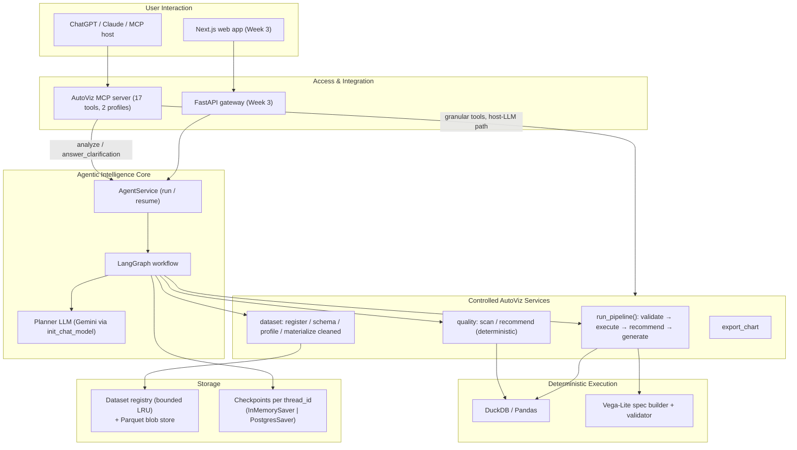
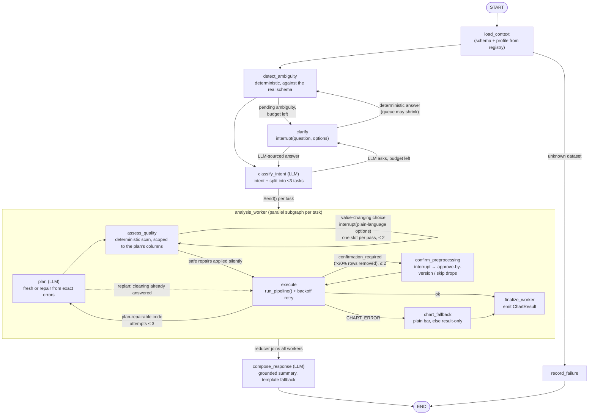

# 08 — Agentic Workflow Architecture (LangGraph)

The internal agentic workflow as **implemented** in `backend/src/autoviz/agent/` +
`backend/src/autoviz/llm/`. It is a **bounded agentic workflow**, not an unconstrained agent:

> The LLM understands and plans; **LangGraph** controls the workflow; AutoViz **services**
> validate and execute; **DuckDB/Pandas** calculate results; **Vega-Lite** renders charts;
> **MCP** exposes the capabilities externally.

**The architectural boundary that makes this safe:** LangGraph decides *when and why* steps
run. `services/orchestrator.run_pipeline()` remains the single deterministic source of truth
for validate → execute → recommend → generate — the graph never re-implements validation or
execution, it only routes around the `status` / `failed_step` contract that `run_pipeline`
already returns (Docs/07 §11).

The row-removal confirmation gate is **not** part of that boundary. It lives one layer lower, in
`services/execution.execute_analysis` — the only function that can apply preprocessing at all.
`run_pipeline` merely translates its refusal into a `status` its own callers understand. A gate
in the orchestrator guarded a door with another door beside it: both the MCP `execute_analysis`
tool and `POST /analysis/execute` reach the preprocessing chain without passing through
`run_pipeline`. **Enforce beside the code that does the thing, not a layer above it.**

## 1. System architecture

Two entry paths share every service function:

1. **External MCP host** (host's LLM plans): the 15 granular tools — no API key needed.
2. **Internal agent** (`analyze` tool now; FastAPI in Week 3): the LangGraph workflow with its
   own planner LLM — one call from NL request to validated charts.

Both paths hit the same gate, because the gate is below both of them.

## 2. Responsibility of each component

| Component | Responsibility | Where |
|---|---|---|
| LangGraph | State, routing, repair loops, retry limits, interrupts, multi-chart fan-out, per-thread persistence | `agent/graph.py`, `agent/routing.py` |
| Planner LLM | Intent + task splitting, typed `analysis_plan` generation/repair, grounded summaries | `llm/client.py` (`GeminiPlanner`) |
| `PlannerLLM` protocol | Provider abstraction — tests inject `FakePlanner`, provider switchable via `AUTOVIZ_PLANNER_MODEL` | `llm/client.py` |
| `run_pipeline()` | One deterministic validate → execute → chart pass; structured `failed_step` errors; translates the execution layer's `CONFIRMATION_REQUIRED` into `status: confirmation_required` | `services/orchestrator.py` |
| `execute_analysis()` | Applies preprocessing and **owns the row-removal gate** — every caller, agent or not, passes through it | `services/execution.py` |
| Quality scanner | Deterministic (no LLM) issue detection + plain-language recommendations, scoped to the plan's columns | `services/quality.py` |
| DuckDB/Pandas | The actual numbers (parameterized SQL, closed grammar) | `services/execution.py` |
| Vega-Lite | Chart representation + structural validation | `services/charts.py` |
| MCP | External exposure: `analyze`, `answer_clarification` + the 15 granular tools | `mcp/server.py` |
| Checkpointer | Thread checkpoints (all three pause kinds, refinement history). `InMemorySaver` by default, `PostgresSaver` opt-in | `agent/graph.py`, `storage/checkpoint.py` |

The planner LLM **cannot**: execute Python/SQL, touch the filesystem, bypass row/limit caps,
or compute final values — it only fills the closed plan grammar (`schema/plan_guide.py`, now
shared verbatim between the MCP tool descriptions and the internal planner's system prompt).

## 3. The workflow graph

This is primarily a **workflow** (predetermined safety/execution paths) with agentic elements
only where they pay off: plan generation, structured repair, task splitting, clarification.

## 4. Graph state (`agent/state.py`)

Only identifiers, metadata, plans, and bounded results enter state — never DataFrames.

- **Main state** (`AutoVizState`): `user_request`, `dataset_id`, `schema`, `profile`,
  `intent`, `tasks`, clarification fields, `chart_results`, `history`, `status`,
  `final_response`.
- **`chart_results`** uses a custom reducer (`add_or_reset`): parallel workers append their
  `ChartResult`; passing `None` at the start of a run resets it, because thread checkpoints
  persist across invokes and results must not leak between runs on the same thread.
- **`history`** accumulates `{request, plans}` per run on the thread — this is what grounds
  refinements ("same but as a pie chart" → the planner receives the previous plan).
- **Worker state** (`WorkerState`) is private to each Send branch: `task`, `analysis_plan`,
  `rejected_plan`, `validation_errors`, `plan_attempts`, `pipeline_output`,
  `approved_preprocessing_hash` (the version the user approved at the row-removal gate),
  `confirmation_count`, and the cleaning fields — `cleaning_resolutions` (slot → the op the user
  chose, or `None` for "leave it alone"), `cleaning_prompts`, `cleaning_done`, `applied_cleaning`.
  The worker subgraph declares `output_schema=WorkerOutput` so **only** `chart_results` flows
  back to the parent — worker internals must not collide across parallel branches.
- **`ChartResult`**: `{task, status: ok|partial|error, plan, attempts, result, chart_spec,
  vega_lite_spec, warnings, errors}`.

Limits (in `agent/state.py`): `MAX_PLAN_ATTEMPTS = 2` (repairs after the first generation →
≤ 3 LLM plan calls per task), `MAX_TASKS = 3`, `MAX_CLARIFICATIONS = 2`,
`MAX_CLEANING_PROMPTS = 2`, `MAX_CONFIRMATIONS = 2`.

Every loop in the graph is budgeted, including the two that only *look* self-terminating. The
confirmation loop previously relied on both answers happening to defuse the gate; a third op
whose "skip" branch left the gate tripped would have spun forever. A loop that terminates by
coincidence is not bounded — it is unbounded and lucky.

## 5. Node responsibilities (`agent/nodes.py`)

| Node | Type | Responsibility |
|---|---|---|
| `load_context` | deterministic | Registry lookup; schema + profile into state; unknown id → fail fast, planner never called |
| `detect_ambiguity` | deterministic | Matches the request against the real schema; queues only *material* ambiguities. No LLM, so it cannot invent one |
| `classify_intent` | LLM (JSON) | One call: intent (`analysis`/`refinement`/`clarification`) + split into ≤ 3 self-contained tasks + optional clarification question. Planner failure degrades to "single analysis task = raw request" |
| `clarify` | interrupt | `interrupt({question, options})` pauses the graph; a deterministic answer re-runs `detect_ambiguity` (the queue may have shrunk), an LLM-sourced one goes to `classify_intent`. `MAX_CLARIFICATIONS = 2` rounds, then best-effort |
| `plan` (worker) | LLM (JSON) | Fresh plan, or **repair**: receives the rejected plan + exact validator errors and changes only what the errors require. `dataset_id` is overwritten server-side — never trusted from the LLM |
| `assess_quality` (worker) | deterministic + interrupt | Scans `plan.referenced_columns()` only; merges SAFE repairs into the plan silently; interrupts with one plain-language cleaning question per pass (`pause_kind: "cleaning_choice"`) until the queue empties or `MAX_CLEANING_PROMPTS` is spent. Binds the answer deterministically, defaulting to "do nothing" when it cannot be read |
| `execute` (worker) | deterministic | `run_pipeline()` (passing any `approved_preprocessing_hash`); retries infrastructure faults (`EXECUTION_ERROR`/`TIMEOUT`) in place with backoff before routing decides replan vs finalize vs confirm |
| `confirm_preprocessing` (worker) | interrupt | Presents the execution layer's `confirmation_required` (large row removal). "Proceed" approves this exact block by `preprocessing_version(dataset_id)` and re-executes; anything else strips the ops whose model declares `removes_rows` (keeping `fill_nulls`) and runs on full data. Logs the decision |
| `chart_fallback` (worker) | deterministic | After a successful execution whose chart step failed: one plain bar attempt, else keep the result table with no chart |
| `finalize_worker` | deterministic | Emits one `ChartResult`; partial results are never discarded |
| `compose_response` | LLM | Summary grounded strictly in result tables + provenance; deterministic template fallback so composing can never fail the run |
| `record_failure` | deterministic | Structured `{status: "failed", errors}` |

## 6. Failure-routing policy (`agent/routing.py`)

Routing branches on the **typed `error_code`** `run_pipeline` returns (`autoviz.errors`), not on
`failed_step` — so a plan defect is replanned, an infrastructure fault is retried, and a terminal
fault stops, instead of every failure burning the replan budget (Doc [10 §1](10-Validation-Security-Resource-Controls.md)):

| Condition | Route |
|---|---|
| Unknown `dataset_id` at `load_context` | `record_failure` — stop before any LLM call |
| Planner output unparseable | Retry `plan` while attempts remain, else finalize as error |
| Plan produced, cleaning pass not yet done | → `assess_quality`; a replan skips it, its answers already being in state |
| Cleaning questions outstanding, budget left | → `assess_quality` again (one slot per pass); budget spent → `execute` with whatever is unresolved left alone |
| `error_code: INVALID_PLAN` / `TYPE_MISMATCH` (plan-repairable) | → `plan` (repair) while `plan_attempts < 3` |
| `error_code: EXECUTION_ERROR` / `TIMEOUT` (retryable) | Retried in place with backoff in `execute_node` (`MAX_EXEC_RETRIES`); then finalize — **never** replanned |
| `error_code: UNKNOWN_DATASET` / `RESOURCE_LIMIT` (terminal) | Finalize — no replan, no retry |
| `status: confirmation_required` (cleaning removes >30% of rows, unapproved) | → `confirm_preprocessing` (interrupt) while `confirmation_count < 2`; on resume re-`execute`. Budget spent → finalize carrying the refusal, rather than re-prompting forever |
| Repairs exhausted | Worker finalizes `status: "error"` with the exact validator errors; other workers unaffected |
| `failed_step: recommend_chart_type` / `generate_chart` (`CHART_ERROR`) | → `chart_fallback` (result already computed — keep it) |
| Compose LLM fails | Deterministic template summary |
| Any exception in `AgentService` | Caught → `{status: "failed", errors: [...]}` — never raised to the caller |

A worker failure is a **partial failure**: the other charts still return, and the summary
states plainly which task failed and why.

## 7. Multi-chart fan-out

"Show average fare by class and the age distribution" → `classify_intent` splits into
independent tasks → the conditional edge returns one `Send("analysis_worker", {task, ...})`
per task (`langgraph.types.Send`) → workers run the full plan/repair/execute loop in
parallel → the `chart_results` reducer joins them → one composed response with N charts.
Capped at `MAX_TASKS = 3`.

## 8. Clarification interrupts

`clarify` calls `interrupt(...)` (requires the checkpointer). Mapped onto MCP as a
two-tool handshake:

1. `analyze(...)` returns `{status: "waiting_for_user", question, options, thread_id}`.
2. `answer_clarification(thread_id, answer)` resumes via `Command(resume=answer)` from the
   saved checkpoint; `classify_intent` re-runs with the answer and is instructed not to ask
   again (also enforced by `MAX_CLARIFICATIONS`).

Interrupts fire only when the request is *materially* ambiguous against the actual schema
(two plausible date columns, an undefined metric like "best") — never as a default.

The graph has **three** interrupt points, all requiring the checkpointer: `clarify` (ambiguous
intent, §8 above), `assess_quality` (a cleaning decision that would change values or drop rows,
§9 below), and `confirm_preprocessing` (a cleaning step would remove >30% of rows, §9). All
three map onto MCP as the same `waiting_for_user` → `answer_clarification(thread_id, answer)`
handshake, so a host that ignores the difference still works. `pause_kind`
(`clarification` | `cleaning_choice` | `confirmation`) says which decision it is for hosts that
render them differently — a cleaning choice carries structured options with row counts and a
`recommended` flag, where the other two carry plain strings.

## 9. Preprocessing layer & the row-removal gate

Explicit, opt-in data cleaning that never mutates the source. The planner may add a
`preprocessing` block to a plan; empty (the default) means the immutable-source behaviour.

- **Consent is risk-classified, not percentage-classified.** Every op declares a `Risk`
  (`schema/allowlists.py`): `SAFE` — semantics-preserving, applied automatically and reported;
  `VALUE_CHANGING` — alters values or row membership, **always** confirmed, including below 5%;
  `AMBIGUOUS` — never auto-proposed at any percentage. Percentage only escalates *within* a
  tier. Changing 1% of a revenue column can move a total; trimming whitespace in 80% of labels
  cannot, so row count alone cannot decide consent.
- **Grammar** (`schema/analysis_plan.py`). SAFE: `trim_whitespace`, `empty_string_to_null`,
  `normalize_case`, `drop_empty_rows`, `cast_column` (number/datetime). VALUE_CHANGING:
  `drop_nulls` (any/all), `fill_nulls` (`constant` | `median` | `mode` — no mean,
  outlier-sensitive), `drop_exact_duplicates`, `clean_categories` (explicit mapping),
  `group_rare_categories` (`top_n` xor `min_frequency`); plus `is_null` / `is_not_null` filter
  ops. Bounded by `MAX_PREPROCESSING_STEPS = 10` / `MAX_PREPROCESSING_COLUMNS = 20` /
  `MAX_CATEGORY_MAPPING = 50` / `MAX_TOP_CATEGORIES = 50`.
  Category cleaning is VALUE_CHANGING, not SAFE: both ops merge values that were distinct, so
  two rows that meant different things can land in one bar. `clean_categories` is **only ever
  explicit** — nothing infers a mapping by similarity, because "UK"/"U.K."/"United Kingdom" is
  obvious to a person and a guess to a program. Exact whitespace/case equivalence is the SAFE
  ops' job instead. `group_rare_categories` never buckets nulls: missing is not rare.
  Each op model carries `removes_rows` / `risk` ClassVars and `columns_touched()`; a subclass
  omitting either is a definition-time `TypeError`. The two flags are orthogonal —
  `drop_empty_rows` is SAFE *and* row-removing. Nothing infers behaviour from an op's *name*:
  every such inference failed open (an unrecognised row-dropping op skipped the gate, survived
  "Skip cleaning", and crashed as a retryable error).
- **Automated cleaning** (`services/quality.py` + the `assess_quality` worker node):
  deterministic, no LLM. Scoped to `plan.referenced_columns()`, so a messy column the analysis
  never reads produces no findings. Splits into `auto_apply` (SAFE, merged into the plan ahead
  of the planner's own ops) and `proposals` (plain-language questions with exact counts and one
  `recommended` option). A proposal is suppressed when the plan already handles that column —
  an explicit instruction is never re-litigated. Missing values are only *asked about* for
  **dimension** columns: a null grouping key becomes a spurious category, while a null measure
  is already skipped and disclosed, and a null in a selected column is simply not plotted.
  High cardinality is judged the same way and offers `group_rare_categories(top_n=10)`.
  Budgeted by `MAX_CLEANING_PROMPTS = 2`; an unreadable answer resolves to "do nothing".
  Merged suggestions are capped so they can never push a plan past
  `MAX_PREPROCESSING_STEPS` — the trimming falls on the tool's suggestions, never on the
  planner's own ops, so helpfulness cannot invalidate a request the user got right.
- **Validation** (`services/validation.py`): column existence, strategy/type compatibility,
  `constant` shape (JSON scalar, finite, length-capped, type-cast — *not* code-pattern matched),
  conflicting-op rejection. 100%-null columns become `unusable_columns` the planner may not select.
- **Execution** (`services/execution.py`): a **parameterized DuckDB CTE chain over `df_raw`**
  ahead of filter/derive/aggregate — a read-only working view, not ingestion-time cleaning and
  not `CREATE VIEW`. Deterministic `mode` (frequency desc, value asc — never DuckDB `mode()`);
  structured error on all-null median/mode. Reports per-op `rows_affected`, `input_rows`/
  `output_rows`, `provenance.preprocessing[_sql]`, and implicit null exclusions.
- **The gate** (`services/execution.execute_analysis`): if cleaning would remove more than
  `ROW_DROP_CONFIRM_FRACTION` (30%) of rows, refuse with `error_code: CONFIRMATION_REQUIRED`
  **unless** the caller passed the matching `approved_preprocessing_hash`. `run_pipeline`
  translates that into `status: confirmation_required` for its own callers.
  It lives in `execute_analysis`, not the orchestrator, because that is the only function that
  can run `_apply_preprocessing` — a gate one layer up guarded a door with another door beside
  it, and both the MCP `execute_analysis` tool and `POST /analysis/execute` walked through it.
  **Enforce next to the code that does the thing, not a layer above it.**
  Approval is bound to `preprocessing_version(dataset_id)` = `pp_<12 hex>` over
  (dataset_id + canonical block): consent is for a *measured impact*, so the same block against
  a different frame — where it may remove far more — re-gates. Order-insensitive fields are
  canonicalised so a replan that reorders `drop_nulls.columns` does not re-prompt; the op list
  order is left alone, being genuinely semantic.
- **Disclosure** (`provenance`): `implicit_null_exclusions` is measured on the *pre*-cleaning
  relation, so imputing cannot erase the very disclosure it should trigger. `fill_nulls` above
  `ROW_DROP_NOTICE_FRACTION` (5%) adds an `imputation_notices` entry. `provenance.cleaning`
  collects the whole account in one place — `version_id`, `columns_inspected`, per-step effect,
  `input_rows`/`output_rows`, `confirmed_by_user`, and the `parent` when the source is itself a
  cleaned dataset — so a number is traceable back through cleaning, not only back to a query.
- **Versioning is logical, materialisation is opt-in.** The cleaned frame is fully determined by
  (immutable source, ops), so `preprocessing_version` identifies it without storing anything and
  every analysis carries its version for free. `materialize_cleaned_dataset` (service, MCP tool,
  `POST /datasets/{id}/cleaned`) is the one explicit exception, for a user who wants to keep
  working from cleaned data: it registers a normal dataset recording `parent_id`/`version_id` in
  its profile's `lineage`, leaves the parent untouched, and passes through the same gate — a 60%
  removal is no less consequential for being deliberate. The HTTP route persists it as a Parquet
  blob like an upload, because a dataset the user now owns must not vanish on cache eviction.
- **Agent integration**: two nodes, two different jobs (§5–§6). `assess_quality` asks *whether*
  to clean — before anything runs, in plain language, scoped to the analysis. `confirm_preprocessing`
  presents the gate when a block the user (or planner) already chose turns out to remove more than
  30% of rows, and binds the answer; "skip" strips the ops whose model declares `removes_rows` and
  keeps `fill_nulls`. Both are budgeted, both log their decision, and neither can be reached
  without the checkpointer.

## 10. Memory and persistence

| Storage | Contents | Today |
|---|---|---|
| LangGraph checkpoints | Per-`thread_id` state: pending interrupts, refinement history | `InMemorySaver` by default; `PostgresSaver` when `AUTOVIZ_AGENT_CHECKPOINTER=postgres` (`storage/checkpoint.py`). Setup failure falls back to in-memory, so an unreachable database degrades durability rather than breaking the agent |
| Dataset registry | Registered DataFrames, schema, profile | Bounded LRU cache with an injected loader (`storage` depends on `services`, never the reverse) |
| Dataset payloads | Parquet bytes + cached schema/profile | `storage/blobs.py` — an evicted or restarted-away dataset reloads on the next miss. Parquet, not the original CSV, because it round-trips dtypes exactly: re-parsing a CSV re-runs `_coerce_datetimes`, so the reloaded schema is only *probably* the one the plan was validated against |
| Cleaned-dataset lineage | `parent_id`, `version_id` | Inside the profile's `lineage` key, so it rides the existing `profile_json` column with no migration |
| Exports | Self-contained chart HTML | `backend/exports/` |

`thread_id` = one conversation (auto-generated `th_<hex>` if not supplied, always returned).
Raw CSV rows and API keys never enter checkpoints; result tables entering `ChartResult` are
already row-capped (hard ceiling 100000) by the execution layer.

## 11. The planner LLM (`llm/client.py`)

- **Provider**: Google Gemini by default — `AUTOVIZ_PLANNER_MODEL` env var
  (`google_genai:gemini-2.5-flash`), created lazily via LangChain's `init_chat_model`, so any
  provider id works and importing the server never requires a key. Key: `GOOGLE_API_KEY`
  (free at aistudio.google.com), loaded from environment or `backend/.env` (gitignored).
- **Contract**: the `PlannerLLM` protocol (`classify`, `generate_plan`, `compose`). All
  output is parsed/validated here; failures surface as `PlannerError`, which nodes catch and
  degrade from — a planner outage produces a structured failure, never a crash.
- **Grounding**: `generate_plan`'s system prompt is `schema/plan_guide.py` — the *same*
  grammar text the MCP tool descriptions ship — plus the live schema/cardinality; repair
  calls receive the rejected plan and the exact validator errors.
- **Tests** run fully offline with a scripted `FakePlanner` (`tests/test_agent.py`).

## 12. MCP exposure

| Tool | Purpose |
|---|---|
| `analyze(request, dataset_id?, file_ref?, thread_id?)` | One-shot agentic analysis: NL request → up to 3 validated charts + grounded summary. Reuse `thread_id` to refine |
| `answer_clarification(thread_id, answer)` | Resume a run paused with `waiting_for_user` |
| `analyze_data_quality(dataset_id, columns?)` | Read-only scan → issues, auto-appliable SAFE ops, and proposals with counts. **Default profile**: a host that cannot see a dataset's problems plans around them badly |
| `preview_preprocessing(dataset_id, analysis_plan)` | Read-only impact of a plan's cleaning block before committing to it (advanced profile) |
| `materialize_cleaned_dataset(dataset_id, preprocessing)` | The one explicit write tool: registers the cleaned frame as a new dataset, parent untouched, same gate (advanced profile) |

17 tools across two profiles (`AUTOVIZ_MCP_PROFILE`, default `advanced`): 6 in `default` —
the coherent register → assess → analyse → export path — plus 11 granular ones for
orchestration and testing. The granular tools (Docs/07) remain the host-LLM path and need no
API key; `analyze` is also exposed over HTTP by the FastAPI backend at `POST /agent/analyze`
(Doc [11](11-Backend-API-and-Persistence.md)), alongside `POST /analysis/quality`,
`POST /analysis/preview-preprocessing`, and `POST /datasets/{id}/cleaned`.

Every MCP tool call (including `analyze`/`answer_clarification`) is logged once at the tool
boundary by the `@observed` decorator — tool name, input hash, latency, output size, outcome, and
(on failure) the typed `error_code`/`failed_step` — to stderr + `backend/logs/autoviz.log`, never
stdout (see Docs/07 § Observability and Docs/10 §5). Per-node tracing *inside* the graph is deferred
(§13, "evaluation traces").

## 13. Deferred (deliberately, per the feasibility scope)

Durable **provenance** store (the checkpointer half is done — see §10); vector/BM25 tool
retrieval (the tool set is small enough for direct selection); LLM cost tracking and
evaluation traces.

Deliberately **not built** in the preprocessing layer, with reasons — these are decisions, not
backlog: per-op MCP mutation tools (one write path is what makes the gate enforceable);
binning, outlier removal, and scaling; **column renaming** — a column name is the identifier in
plan JSON, in `_q()`-quoted SQL, in chart-spec channels and in provenance keys, so renaming
silently breaks every stored plan that referenced the old name; and **inferred** category
mappings — "UK"/"U.K."/"United Kingdom" is obvious to a person and a guess to a program, and a
wrong guess silently merges two real categories into one bar. Exact whitespace/case equivalence
is handled by the SAFE ops instead, and the user-facing benefit of renaming is delivered by
resolving user-typed names onto real columns at plan time (`agent/ambiguity.py`).

## 14. Verification

- `uv --directory backend run pytest -q` — 463 tests, offline: happy path, repair-loop
  recovery, repairs exhausted, parallel multi-chart, interrupt round-trip, resume-without-
  pause error, refinement grounding, chart fallback with partial result, unknown dataset,
  plus the error taxonomy / resource limits / observability suites (Docs/10) and the
  end-to-end Titanic workflow (`tests/test_titanic_workflow.py`).
- The preprocessing suites specifically: `test_preprocessing.py` (execution),
  `test_preprocessing_hardening.py` (gate reachability, unknown-op loudness, parameter
  ordering, cross-dataset version reuse), `test_preprocessing_gate.py` (the row-removal gate
  through all three entry points), `test_preprocessing_safe_ops.py`,
  `test_preprocessing_categories.py`, `test_quality.py` (scan/recommend against fixtures with
  documented exact counts), `test_preprocess_guard.py` (the agent-level guard: the worker
  presents the gate as an interrupt and binds proceed-vs-skip), `test_agent_cleaning.py`,
  `test_api_quality.py`, `test_materialize.py`.
- Four of those tests exist because their absence hid real defects: the gate was reachable
  ungated from two entry points, an unhandled op crashed as a *retryable* error and was retried
  forever, no test ever combined two `fill_nulls` with a value-bearing filter (the parameter
  concatenation was unpinned), and `PreprocessError` had no test that reached it at all. A
  layer can be entirely correct in the paths that are tested and unsafe to extend in the ones
  that are not.
- Live (needs `GOOGLE_API_KEY`): call `analyze` from an MCP host after restarting the host
  session.
