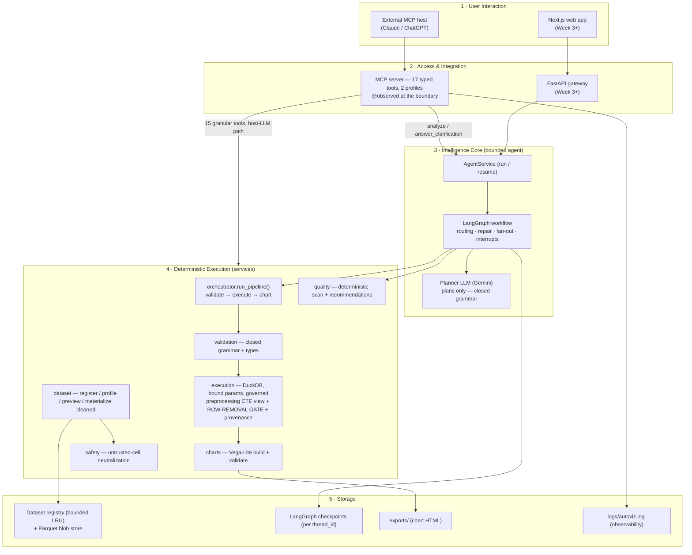
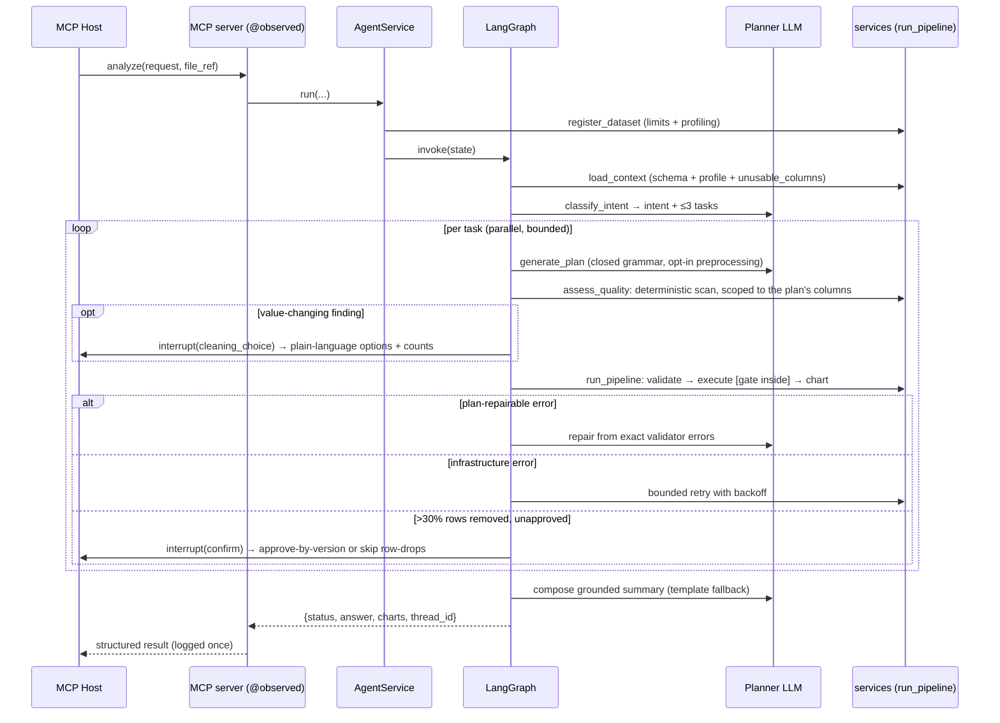

# 09 — System Architecture & Design

The complete system architecture of AutoViz AI as **implemented** in `backend/` (Weeks 1–4).
Doc [08](08-Agentic-Workflow-Architecture.md) zooms into the LangGraph intelligence core; this
document is the system-level view — the five layers, how a request flows through them, and the
one design principle every layer serves.

> **The invariant that defines the system:** the LLM only *plans*. It never computes a number,
> runs code, or touches the filesystem. Pandas/DuckDB deterministically *compute*, validation
> *guards*, and Vega-Lite *renders*. Everything below exists to keep that boundary intact.

## 1. Layered architecture

Two entry paths, **one service layer** — the granular MCP tools and the internal agent both call
the exact same functions in layer 4, so behaviour can never diverge between "host plans" and
"AutoViz plans".

## 2. Layer responsibilities

| Layer | Responsibility | Key modules |
|---|---|---|
| 1 · Interaction | Where a request originates: an MCP host's LLM, or the web client | (host) · `frontend/` |
| 2 · Access | Model-independent tool surface + (soon) HTTP API; **observability boundary** | `mcp/server.py`, `observability.py`, `api/` |
| 3 · Intelligence | Interpret NL → intent → tasks → typed plans; route repairs/retries; fan-out; clarify | `agent/`, `llm/client.py` |
| 4 · Execution | Deterministically validate, compute, and render — the only layer that produces numbers | `services/` |
| 5 · Storage | Datasets (LRU cache over durable Parquet blobs), per-thread checkpoints, exported charts, logs | `services/registry.py`, `storage/`, `exports/`, `logs/` |

## 3. Request lifecycle (agentic path)

The host-LLM path is the same picture minus layer 3: the host calls `register_dataset` →
`get_dataset_*` → `run_analysis_pipeline` directly, planning the grammar itself.

## 4. Technology stack & rationale

| Concern | Choice | Why |
|---|---|---|
| Tool protocol | **Model Context Protocol** (stdio now) | Model-independent; the same server works for any MCP host |
| Orchestration | **LangGraph** | Explicit state/edges = auditable bounds (attempts, tasks, interrupts) vs a free-form agent |
| Planner LLM | **Gemini** via LangChain `init_chat_model` | Free tier for the MVP; provider swap is one env var (`AUTOVIZ_PLANNER_MODEL`) |
| Compute | **DuckDB + Pandas** | In-process analytical SQL; parameter binding makes injection structural, not incidental |
| Charts | **Vega-Lite** | Declarative JSON spec — buildable and *validatable* without rendering |
| API/Web | **FastAPI + Next.js** | Layer-4 services are framework-free, so routes are thin adapters |

## 5. Design principles

1. **Plan/compute separation.** The planner fills a closed grammar (`schema/analysis_plan.py`);
   it cannot emit SQL or code. Every number comes from bound-parameter DuckDB.
2. **One source of truth.** `orchestrator.run_pipeline()` is the single validate→execute→chart
   path; the graph routes *around* its `status`/`error_code` contract, never re-implements it.
   Safety checks, though, sit *below* the orchestrator rather than inside it — see principle 7.
3. **Structured failure, never exceptions.** Every tool returns typed content — including a
   typed `error_code` (Doc [10](10-Validation-Security-Resource-Controls.md)) — so a host LLM,
   the agent, and the logs all reason about failures the same way.
4. **Bounded everything.** ≤3 tasks, ≤3 plan attempts, ≤2 clarifications, ≤2 cleaning prompts,
   ≤2 confirmations, bounded exec-retries, 100000-row output ceiling, CSV/DuckDB resource caps.
   No unbounded loop exists — and none is allowed to terminate merely because both of its
   branches currently happen to, which is unbounded-and-lucky rather than bounded.
5. **Untrusted data stays data.** CSV cell values and column names are neutralized before they
   reach any LLM context; the real values are used only for grouping/SQL.
6. **Immutable source, explicit cleaning.** The registered DataFrame is never mutated.
   Preprocessing runs as a per-analysis, read-only DuckDB CTE working view ahead of
   filter/derive/aggregate, and every step reports `rows_affected` + SQL provenance.
   Consent is **risk-classified, not percentage-classified**: `SAFE` ops (whitespace, empty-string
   → null, exact case-folding, empty rows, admissible casts) are semantics-preserving and applied
   automatically; `VALUE_CHANGING` ops (`drop_nulls`, `fill_nulls`, `drop_exact_duplicates`,
   `clean_categories`, `group_rare_categories`) are always confirmed, *including below 5%*;
   `AMBIGUOUS` is never auto-proposed at any percentage. Changing 1% of a revenue column can move
   a total; trimming whitespace from 80% of labels cannot — so row count alone cannot decide
   consent, it only escalates *within* a tier.
7. **Enforce beside the code that does the thing, not a layer above it.** The >30% row-removal
   gate lives in `execution.execute_analysis` — the only function that can apply preprocessing —
   not in `run_pipeline`, which merely translates its refusal. A gate in the orchestrator guarded
   a door with another door beside it: the MCP `execute_analysis` tool and `POST /analysis/execute`
   both reach the cleaning chain without going through `run_pipeline`. Approval is bound to
   `preprocessing_version(dataset_id)`, not to the block alone, because consent is for a *measured
   impact* — the same block against a different frame re-gates.
8. **Behaviour is declared by the model, never inferred from a name.** Each preprocessing op
   carries `removes_rows` / `risk` ClassVars and `columns_touched()`; omitting either is a
   definition-time `TypeError`. This replaced five independent op-name allowlists that all
   defaulted to unsafe-but-permitted for an unrecognised op.

## 6. Deployment topology

- **MCP host:** `python -m autoviz.mcp`, stdio transport, in-memory registry. Local, no network surface.
- **HTTP backend (implemented, Doc [11](11-Backend-API-and-Persistence.md)):** FastAPI gateway reusing
  the layer-4 services and `AgentService`, with a **PostgreSQL** storage layer (accounts, dataset
  metadata, saved charts, dashboards) and session-isolated uploads. Next.js talks to it. Optional
  `PostgresSaver` gives durable agent threads. Both entry paths share the one `REGISTRY`.
- **Deferred (by scope, not by accident):** Streamable-HTTP transport hardening (OAuth, origin checks,
  rate limiting — Doc 10 §6), dashboard image/PDF export, per-request agent-thread ownership. The layer
  boundaries already isolate these.

## 7. Where each concern lives (map to code)

| Concern | File |
|---|---|
| MCP tools / resources / prompt | `mcp/server.py` |
| Per-call logging | `observability.py` |
| Agent graph / routing / nodes / state | `agent/graph.py`, `routing.py`, `nodes.py`, `state.py` |
| Planner protocol + Gemini impl | `llm/client.py` |
| Pipeline orchestration (translates the gate's refusal) | `services/orchestrator.py` |
| Plan grammar + allow-lists + preprocessing ops + `Risk` tiers | `schema/analysis_plan.py`, `schema/allowlists.py` |
| Validation (semantic + preprocessing) | `services/validation.py` |
| DuckDB execution + preprocessing CTE + **row-removal gate** + provenance | `services/execution.py` |
| Deterministic quality scan + plain-language recommendations | `services/quality.py` |
| Chart recommend/build/validate | `services/charts.py` |
| Dataset register/profile + limits | `services/dataset.py` |
| Untrusted-cell neutralization | `services/safety.py` |
| Typed error taxonomy | `errors.py` |

## 8. Verification

`uv --directory backend run pytest -q` — **463 tests, fully offline** (scripted `FakePlanner`,
real DuckDB/Vega-Lite). Covers the agentic workflow, the granular services, the error taxonomy
and resource limits (Doc 10), observability records, the preprocessing layer (execution,
validation, safe ops, category ops, the quality scanner, the row-removal gate through all three
entry points, agent-level cleaning, and materialisation), and the end-to-end Titanic workflow
(`tests/test_titanic_workflow.py`: register → profile → plan → validate → execute → chart).
