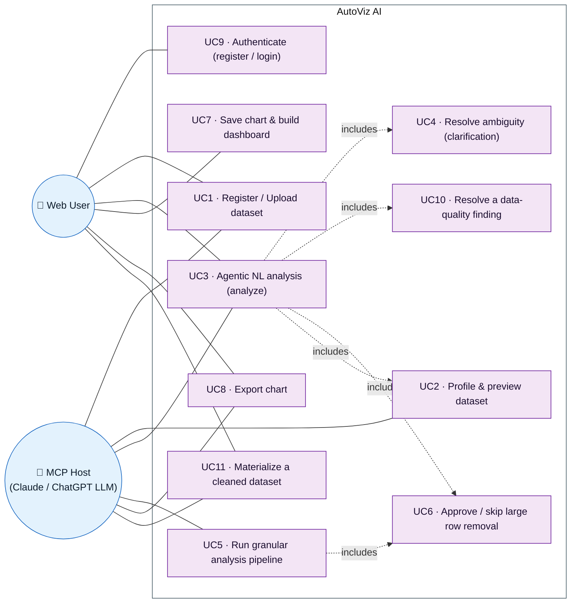
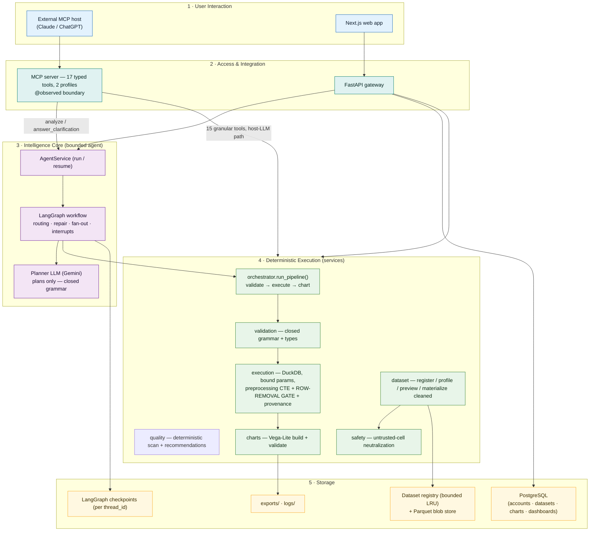
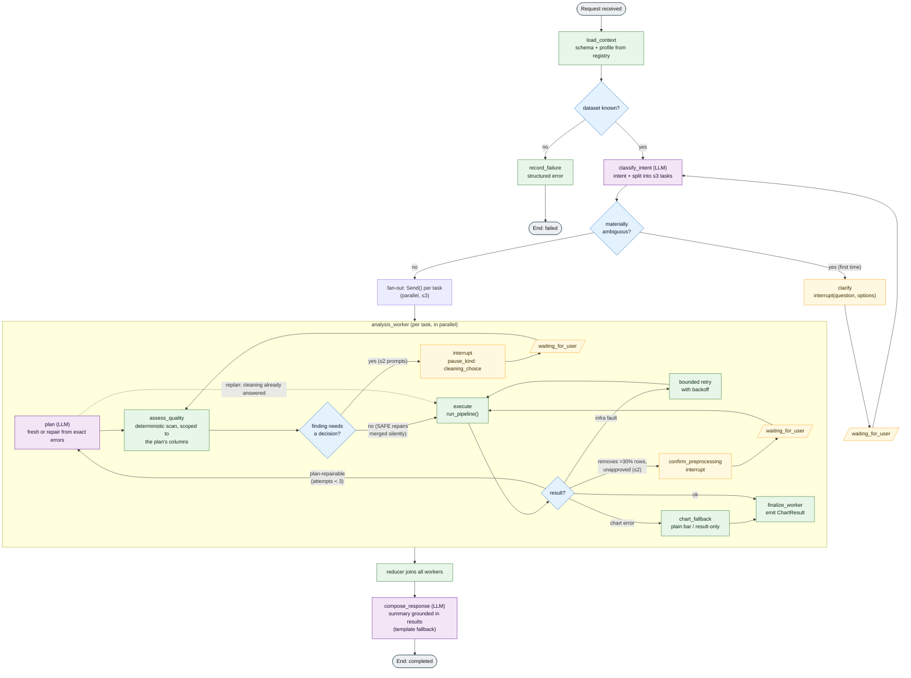
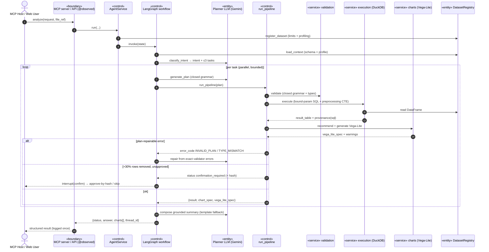
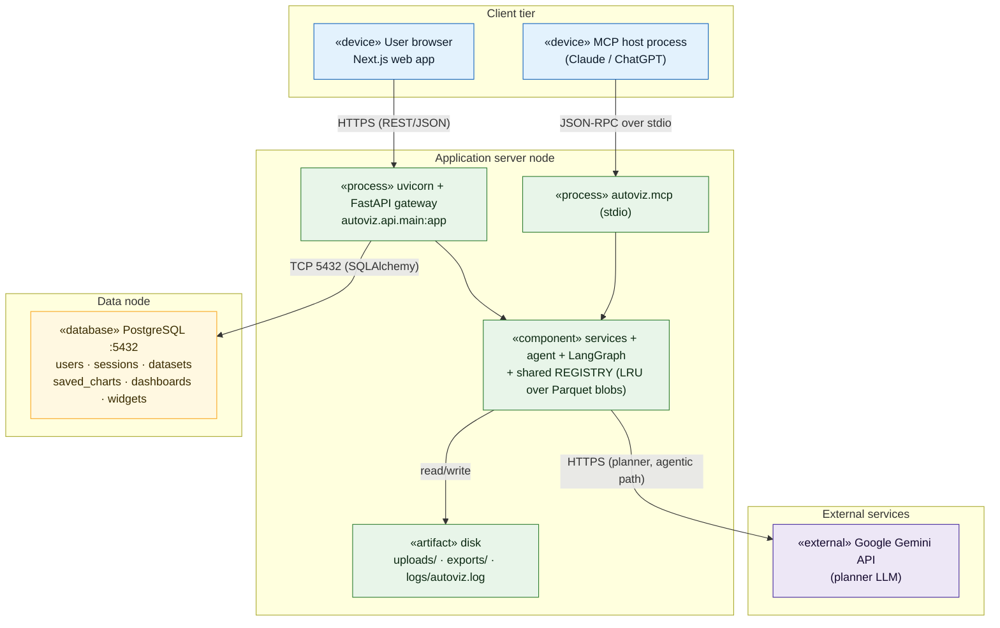
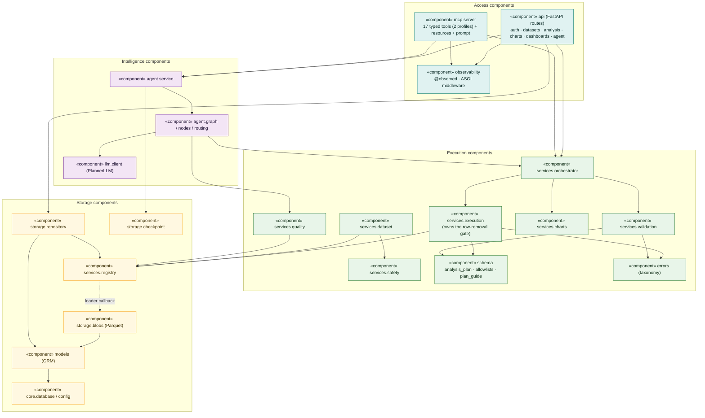
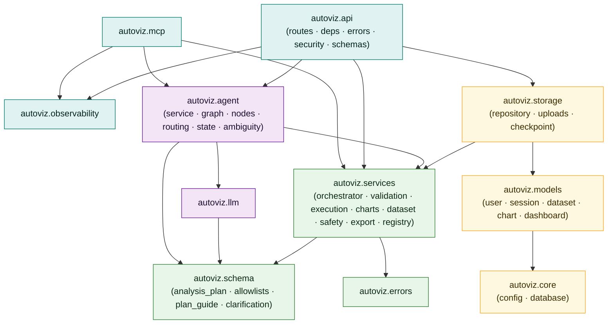
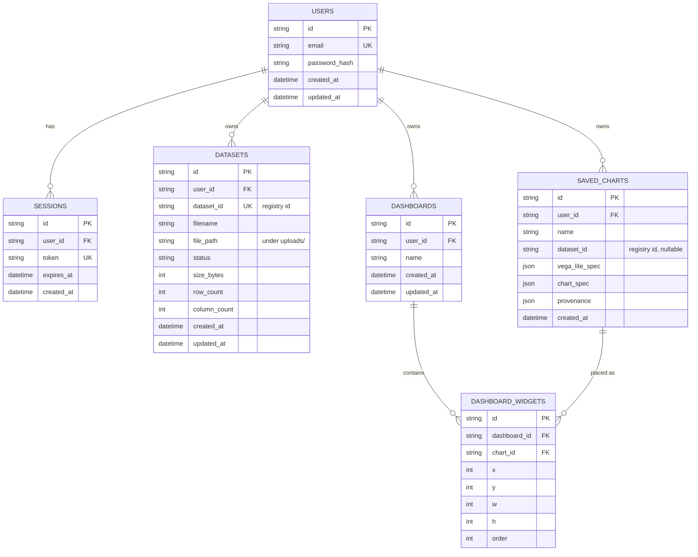

# AutoViz AI — Software Architecture Document

**University of Moratuwa · Department of Computer Science and Engineering · Group 5 (P09)**
**Software Architecture Document — Version 1.0**

| | |
|---|---|
| Project | AutoViz AI — A Conversational Data Visualization and Dashboard Builder Using LLM-Guided CSV Analysis |
| Course | In22-S5-CS3501 Data Science and Engineering Project |
| Document identifier | AutoViz-SAD-1.0 |
| Status | Baselined (reflects `backend/` as implemented, Weeks 1–4) |
| Confidentiality | Confidential © Group 5, 2026 |

---

## Revision History

| Date | Version | Description | Author |
|---|---|---|---|
| 25/Jul/26 | 1.0 | Initial baseline. Consolidates the implemented five-layer architecture (Docs 07–11) into the RUP Software Architecture Document structure: use-case, logical, process, deployment, implementation, and data views. | K.S.H. Daishika (230112C) |

> **Note on diagrams.** All diagrams in this document are authored as **Mermaid** (text-based diagrams-as-code) and render directly in GitHub / any Mermaid-aware Markdown viewer. Colour is used deliberately and consistently: each of the five architectural layers keeps the **same colour** across every diagram (Interaction = blue, Access = teal, Intelligence = purple, Execution = green, Storage = amber). Figures use the caption form *Figure N. Caption* and are referenced in the text as "Figure N". The authoring tool is recorded in §1.4.

---

## Table of Contents

1. [Introduction](#1-introduction)
   - 1.1 [Purpose](#11-purpose)
   - 1.2 [Scope](#12-scope)
   - 1.3 [Definitions, Acronyms, and Abbreviations](#13-definitions-acronyms-and-abbreviations)
   - 1.4 [References](#14-references)
   - 1.5 [Overview](#15-overview)
2. [Architectural Representation](#2-architectural-representation)
3. [Architectural Goals and Constraints](#3-architectural-goals-and-constraints)
4. [Use-Case View](#4-use-case-view)
   - 4.1 [Use-Case Realizations](#41-use-case-realizations)
5. [Logical View](#5-logical-view)
   - 5.1 [Overview](#51-overview)
   - 5.2 [Architecturally Significant Design Packages](#52-architecturally-significant-design-packages)
6. [Process View](#6-process-view)
7. [Deployment View](#7-deployment-view)
8. [Implementation View](#8-implementation-view)
   - 8.1 [Overview](#81-overview)
   - 8.2 [Layers](#82-layers)
9. [Data View](#9-data-view-optional)
10. [Size and Performance](#10-size-and-performance)
11. [Quality](#11-quality)
12. [References](#12-references)

---

## 1. Introduction

This document provides a comprehensive architectural overview of **AutoViz AI**, using a number of different architectural views (use-case, logical, process, deployment, implementation, and data) to depict different aspects of the system. It is intended to capture and convey the significant architectural decisions that have been made, so that the design intent survives beyond any one contributor and can be evaluated against the running code in `backend/`.

### 1.1 Purpose

This document defines and communicates the software architecture of AutoViz AI. It captures the architecturally significant decisions — the layer boundaries, the plan/compute separation, the bounded agentic workflow, the closed-grammar validation, and the security and resource controls — and shows how they are realized in the implemented codebase.

**Intended audience and how they use it:**

| Audience | Use |
|---|---|
| Project team (developers) | Authoritative map of module responsibilities and allowed dependencies before changing code. |
| Mentor / Teaching Assistant / evaluators | Traceability from the proposal's five-layer approach to the implemented system. |
| Frontend & data-engine sub-teams | The contracts (structured tool returns, error taxonomy, persistence schema) their components integrate against. |
| Future maintainers | The rationale ("why") behind the deterministic-execution invariant, so it is not accidentally violated. |

### 1.2 Scope

This SAD applies to the **AutoViz AI backend** as implemented in `backend/src/autoviz/` — the MCP server, the FastAPI HTTP gateway, the LangGraph agentic intelligence core, the deterministic execution services, and the PostgreSQL persistence layer. It also describes the two client entry paths (an external MCP host and the Next.js web application) at the level needed to understand the backend's boundaries.

**In scope:** the architecture of dataset registration and profiling, natural-language-to-plan interpretation, closed-grammar validation, deterministic DuckDB/Pandas execution, chart recommendation and Vega-Lite generation, the explicit preprocessing layer, persistence of accounts / datasets / charts / dashboards, and the cross-cutting concerns of security, privacy, resource control, and observability.

**Out of scope:** the internal implementation of the Next.js frontend canvas; the internal reasoning of external MCP host LLMs; and features explicitly deferred by the feasibility scope (Streamable-HTTP transport hardening, dashboard image/PDF export, per-request agent-thread ownership) — these are noted where relevant as documented deferrals rather than gaps.

### 1.3 Definitions, Acronyms, and Abbreviations

| Term | Definition |
|---|---|
| **MCP** | Model Context Protocol — a model-independent protocol for exposing typed tools/resources/prompts to an AI host. |
| **MCP host** | An external AI application (e.g. Claude Desktop, ChatGPT) whose LLM calls AutoViz's MCP tools. |
| **Analysis plan** | A typed, closed-grammar JSON object describing an analysis (select/filter/derive/group/aggregate/sort/chart). The LLM fills it; it cannot contain SQL or code. |
| **Closed grammar** | A validation model where anything outside explicit allow-lists is a hard error, with no raw-expression fallback. |
| **Plan/compute separation** | The core invariant: the LLM only *plans*; DuckDB/Pandas deterministically *compute*. |
| **Preprocessing gate / row-removal gate** | The confirmation checkpoint in `execution.execute_analysis` that refuses when cleaning would remove more than 30% of rows without a matching approval token. |
| **Risk tier** | `SAFE` / `VALUE_CHANGING` / `AMBIGUOUS` — the primary consent axis for a cleaning op, declared by the op model itself. |
| **Preprocessing version** | `pp_<12 hex>` over (`dataset_id` + canonical preprocessing block). Serves as both the logical cleaned-dataset identity and the gate's approval token. |
| **Provenance** | The exact SQL, columns, filters, aggregations, and preprocessing steps behind every result — traceable per number. |
| **`thread_id`** | Identifier for one conversation; carries refinement history and paused clarification/confirmation state. |
| **`dataset_id`** | Internal identifier for a registered dataset (`ds_<hex>`); decouples analysis from host-specific file references. |
| **LangGraph** | The graph-based orchestration library used to bound the agent's state, edges, retries, and interrupts. |
| **Vega-Lite** | A declarative JSON grammar for interactive charts; specs are built and validated without rendering. |
| **DuckDB** | An in-process analytical SQL engine used for all computation via bound-parameter queries. |
| **CTE** | Common Table Expression — the read-only DuckDB view chain used to apply preprocessing over the immutable source. |
| **SAD** | Software Architecture Document (this document). |
| **RUP** | Rational Unified Process — the methodology this template follows (4+1 views). |

### 1.4 References

Detailed references are consolidated in §12 (IEEE style). The internal documents on which this SAD is based:

- Doc 01 — *Project Proposal* (`Docs/01-Project-Proposal.md`)
- Doc 07 — *MCP Tool Inventory* (`Docs/07-MCP-Tool-Inventory.md`)
- Doc 08 — *Agentic Workflow Architecture (LangGraph)* (`Docs/08-Agentic-Workflow-Architecture.md`)
- Doc 09 — *System Architecture & Design* (`Docs/09-System-Architecture.md`)
- Doc 10 — *Validation, Privacy, Security & Resource Controls* (`Docs/10-Validation-Security-Resource-Controls.md`)
- Doc 11 — *Backend API & Persistence (FastAPI Gateway)* (`Docs/11-Backend-API-and-Persistence.md`)

**Tool used to draw the diagrams:** all figures are written in **Mermaid** (diagrams-as-code) and rendered by the Markdown viewer (GitHub / VS Code Mermaid preview). See §12 for the tool reference and access date.

### 1.5 Overview

The remainder of this document is organized around the RUP 4+1 views:

- **§2 Architectural Representation** names the views used and what each contains.
- **§3 Architectural Goals and Constraints** states the requirements and constraints that shaped the architecture.
- **§4 Use-Case View** presents the architecturally significant use cases and three detailed realizations.
- **§5 Logical View** shows the layered decomposition and the class model of the significant packages.
- **§6 Process View** describes runtime behaviour with an activity diagram and a sequence diagram.
- **§7 Deployment View** shows the two physical deployment topologies (local MCP and HTTP).
- **§8 Implementation View** gives the component diagram and the package/layer structure.
- **§9 Data View** documents the persistent PostgreSQL schema.
- **§10 Size and Performance** and **§11 Quality** cover dimensioning, limits, and non-functional attributes.
- **§12 References** lists all external sources in IEEE style.

---

## 2. Architectural Representation

AutoViz AI is described using the RUP **4+1 view** model. The table below enumerates the views that are necessary for this system and the model elements each contains. Not every canonical view carries equal weight: because the whole system is organized to keep one invariant intact — *the LLM plans, deterministic services compute* — the **Logical** and **Process** views carry the most architectural significance.

| View | Purpose here | Principal model elements | Where |
|---|---|---|---|
| **Use-Case View** | The externally significant behaviours that exercise the architecture. | Actors (Web User, MCP Host), use cases, realizations. | §4 |
| **Logical View** | Static decomposition into layers, packages, and classes. | Five layers; `AnalysisPlan` grammar; services; `AgentService`/graph classes. | §5 |
| **Process View** | Runtime control flow, concurrency, and interrupts. | Activity diagram, sequence diagram, the bounded parallel fan-out. | §6 |
| **Deployment View** | Physical nodes and their interconnections. | MCP-stdio topology; HTTP topology (browser · uvicorn · PostgreSQL · Gemini API). | §7 |
| **Implementation View** | Code organization into components and layered packages. | Component diagram; `autoviz.*` package layering. | §8 |
| **Data View** | Persistent storage perspective. | PostgreSQL ER model (users, sessions, datasets, charts, dashboards). | §9 |

The architecture is fundamentally a **five-layer, hybrid, model-independent** design (Figure 2, §5.1) in which two entry paths — an external MCP host and the web client — share **one** service layer, so behaviour can never diverge between "the host plans" and "AutoViz plans".

---

## 3. Architectural Goals and Constraints

The following requirements and constraints had significant, structural impact on the architecture.

**G1 — Plan/compute separation (safety-critical invariant).** The LLM must never compute a number, run code, or touch the filesystem. It may only *plan* by filling a closed grammar. All computation is deterministic (DuckDB/Pandas). This single goal drives the layer boundary between the Intelligence Core (§5, layer 3) and Deterministic Execution (layer 4).

**G2 — Model independence.** No dependency on a single LLM provider. The tool surface is exposed via MCP (model-independent), and the internal planner is swappable by one environment variable (`AUTOVIZ_PLANNER_MODEL`) behind a `PlannerLLM` protocol.

**G3 — One source of truth for execution.** A single function, `orchestrator.run_pipeline()`, performs validate → execute → recommend → generate. Both entry paths and the agent call it; nothing re-implements validation or execution. Safety enforcement is deliberately *not* placed here — see G8.

**G4 — Structured failure, never exceptions.** No tool ever raises to a caller. Every failure returns typed content carrying a stable `error_code`, so a host LLM, the agent, and the logs reason about failures identically.

**G5 — Bounded everything.** No unbounded loop may exist: ≤3 tasks, ≤3 plan attempts, ≤2 clarifications, ≤2 cleaning questions, ≤2 row-removal confirmations, 1 execution retry, a 100000-row output ceiling, and CSV/DuckDB resource caps. A loop that terminates only because each of its branches currently happens to defuse the condition is not bounded — it is unbounded and lucky, and gets an explicit counter.

**G6 — Untrusted data stays data.** CSV cell values and column names are neutralized before reaching any LLM context, mitigating prompt injection through dataset content.

**G7 — Immutable source, risk-classified cleaning.** The registered DataFrame is never mutated; preprocessing runs as a per-analysis read-only view. Consent is decided by **risk**, not by percentage: semantics-preserving `SAFE` ops apply automatically, `VALUE_CHANGING` ops are always confirmed (including below 5%), and `AMBIGUOUS` ops are never auto-proposed at any percentage. Percentage escalates within a tier but never demotes one — changing 1% of a revenue column can move a total, while trimming whitespace from 80% of labels changes nothing.

**G8 — Enforce beside the code that does the thing, not a layer above it.** A safety check belongs in the narrowest function that can perform the guarded action. The row-removal gate therefore lives in `execution.execute_analysis`, the only function that can apply preprocessing, rather than in `run_pipeline` — which the MCP `execute_analysis` tool and `POST /analysis/execute` both bypass on their way to the same cleaning chain.

**G9 — Declared behaviour over inferred behaviour.** Components state their own properties rather than having callers deduce them from names. Each preprocessing op declares `removes_rows` / `risk` / `columns_touched()`; omitting any is a definition-time `TypeError`, so adding an op cannot silently skip a gate the way five separate op-name allowlists previously allowed.

**Constraints:**

- **C1 — MCP compliance.** The tool surface must conform to the Model Context Protocol; on stdio transport, **stdout is reserved** for the JSON-RPC channel (logs go to stderr + file only).
- **C2 — Offline testability.** The full test suite must run with no network and no API key (a scripted `FakePlanner`, real DuckDB/Vega-Lite).
- **C3 — Technology stack** (committed): Python backend, DuckDB + Pandas, Vega-Lite, LangGraph, FastAPI, Next.js, **PostgreSQL** persistence.
- **C4 — Team & schedule.** Three-member team with a clear division of work (LLM/MCP/integration; frontend/visualization; data-engine/backend); the backend architecture is deliberately framework-free at the service layer so routes and tools are thin adapters that sub-teams can build against in parallel.
- **C5 — Deferred by scope, not accident.** Streamable-HTTP transport hardening (OAuth, origin checks, rate limiting), dashboard image/PDF export, and per-request agent-thread ownership are isolated to specific layers so they can be added without architectural change.

---

## 4. Use-Case View

AutoViz has two actors: the **Web User** (a human, typically non-technical, using the Next.js web app over HTTP) and the **MCP Host** (an external AI application whose LLM drives AutoViz's typed tools over MCP). Both ultimately exercise the same service layer. Figure 2 shows the architecturally significant use cases; there are more than five, satisfying the coverage expectation for a system of this scope.



*Figure 1. AutoViz AI use-case diagram — two actors, eleven architecturally significant use cases, with `include` relationships shown as dashed arrows.*

Figure 1 makes the hybrid access model explicit: the Web User path and the MCP Host path overlap on the core analysis use cases (UC1–UC3, UC8) and each has path-specific extras (authentication and dashboards for the Web User; the granular tool pipeline for the MCP Host). UC4 (clarification), UC10 (data-quality resolution) and UC6 (row-removal approval) are `include`d by the analysis use cases because they are conditional handshakes *within* an analysis, not standalone features. UC11 (materialization) is **not** included by anything: nothing is ever materialized implicitly, so it is only ever invoked directly.

| # | Use case | Actor(s) | Architectural significance |
|---|---|---|---|
| UC1 | Register / upload dataset | Web User, MCP Host | Enforces ingestion resource limits, path-traversal boundaries, and profiling before a CSV is trusted. |
| UC2 | Profile & preview dataset | MCP Host, (Web User) | Exercises the safety neutralization of LLM-facing cell text and column names. |
| UC3 | Agentic NL analysis (`analyze`) | Web User, MCP Host | The central flow: NL → intent → tasks → plans → validated charts; exercises most of the architecture. |
| UC4 | Resolve ambiguity (clarification) | Web User, MCP Host | The clarification interrupt round-trip — a bounded agentic element. |
| UC5 | Run granular analysis pipeline | MCP Host | The host-LLM path calling `run_analysis_pipeline` directly — proves the shared service layer. |
| UC6 | Approve / skip large row removal | Web User, MCP Host | The row-removal gate in `execute_analysis`, enforced for every caller. |
| UC10 | Resolve a data-quality finding | Web User, MCP Host | Scoped automated repair plus one plain-language question per finding. |
| UC11 | Materialize a cleaned dataset | Web User, MCP Host | The one explicit write path: registers the cleaned frame as a new dataset, parent untouched. |
| UC7 | Save chart & build dashboard | Web User | Exercises the PostgreSQL persistence and ownership model. |
| UC8 | Export chart | Web User, MCP Host | Slug-sanitized, sandboxed HTML export. |
| UC9 | Authenticate | Web User | Bearer-token auth and owner-scoped resource access. |

### 4.1 Use-Case Realizations

Four realizations are given, chosen because together they exercise every architectural layer: **UC3** (the central agentic flow), **UC6** (the safety backstop), **UC10** (the consent path that does the day-to-day work), and **UC1** (the ingestion boundary).

#### Realization A — UC3: Agentic NL Analysis (`analyze`)

| Field | Value |
|---|---|
| **Use case name** | Agentic natural-language analysis |
| **Actor** | Web User (via `POST /agent/analyze`) or MCP Host (via the `analyze` tool) |
| **Description** | The user asks a question in plain English about a registered dataset; AutoViz interprets it, splits it into up to three tasks, plans and validates each against the closed grammar, executes deterministically, and returns up to three charts with a grounded summary. |
| **Preconditions** | The dataset is registered (has a `dataset_id`), **or** a resolvable `file_ref` is supplied; a planner API key is configured for the agentic path. |
| **Main flow** | 1. Caller invokes `analyze(request, dataset_id\|file_ref, thread_id?)`. 2. `AgentService.run` resolves/registers the dataset and generates a `thread_id`. 3. `load_context` loads schema + profile from the registry (unknown id → fail fast, no LLM call). 4. `classify_intent` (LLM) determines intent and splits into ≤3 self-contained tasks. 5. For each task in parallel: `plan` (LLM) fills the closed grammar; `assess_quality` scans the plan's columns and applies or asks about cleaning; `run_pipeline()` validates → executes (the gate lives here, inside `execute_analysis`) → recommends → generates the Vega-Lite spec. 6. A reducer joins the workers' `ChartResult`s. 7. `compose_response` (LLM) writes a summary grounded strictly in the result tables and provenance. |
| **Successful end / post-condition** | Returns `{status: "completed", answer, charts[], thread_id}`; every number is backed by SQL provenance; reusing `thread_id` enables refinement. |
| **Fail end / post-condition** | Structured `{status: "failed", errors[]}`; partial results are never discarded — successful charts still return even if one task fails. |
| **Extensions** | (4a) *Materially ambiguous* → UC4 clarification interrupt. (5a) *Plan-repairable error* → the plan is regenerated from exact validator errors (≤3 attempts). (5b) *Infrastructure fault* → bounded retry with backoff. (5c) *Cleaning removes >30% of rows* → UC6 confirmation gate. (5d) *Chart step fails after a good result* → plain-bar fallback, else result-only. |

#### Realization B — UC6: Approve / Skip Large Row Removal (the row-removal gate)

| Field | Value |
|---|---|
| **Use case name** | Approve or skip a large preprocessing row removal |
| **Actor** | Web User or MCP Host (during UC3 or UC5) |
| **Description** | When a cleaning step (e.g. `drop_nulls`, `drop_exact_duplicates`) would remove more than 30% of the rows, execution refuses and asks the caller to confirm, so a silent, large data loss can never happen. This is the backstop, not the primary consent mechanism: `VALUE_CHANGING` ops are already confirmed at any percentage by UC10. |
| **Preconditions** | An analysis plan carries a non-empty `preprocessing` block whose cleaning would drop > `ROW_DROP_CONFIRM_FRACTION` (30%) of rows, and no matching `preprocessing_version` token was supplied. |
| **Main flow** | 1. `execute_analysis()` measures the impact against a governed connection and detects the large removal. 2. It returns `error_code: CONFIRMATION_REQUIRED` with the amount and the `preprocessing_version(dataset_id)` token; `run_pipeline()` translates this into `status: "confirmation_required"` for its own callers. 3. (Agentic path) the `confirm_preprocessing` node raises an `interrupt`, surfaced to the caller as `waiting_for_user`. 4. Caller answers "proceed" → the exact block is approved by that token and re-executed; anything else → the ops whose model declares `removes_rows` are stripped (`fill_nulls` kept) and the analysis runs on full data. 5. The decision is logged. |
| **Successful end / post-condition** | The analysis completes with an auditable record of whether the large cleaning was approved (`provenance.cleaning.confirmed_by_user`); approval is bound to the block **and the dataset** — a repaired block re-gates, and so does the same block replayed against a different frame, because consent was given for a measured impact. |
| **Fail end / post-condition** | If the caller abandons the run, no cleaning is applied and no partial mutation occurs — the source DataFrame was never modified. |
| **Extensions** | (1a) The op is `VALUE_CHANGING` but under 30% → no gate here; UC10 already obtained consent before execution. (1b) The op is `SAFE` yet row-removing (`drop_empty_rows`) → still gated, because `removes_rows` and `risk` are orthogonal flags answering different questions. (4a) The confirmation budget (`MAX_CONFIRMATIONS = 2`) is exhausted → the worker finalizes carrying the refusal rather than re-prompting. |

#### Realization B2 — UC10: Resolve a Data-Quality Finding (the automated cleaning path)

| Field | Value |
|---|---|
| **Use case name** | Automatically repair, or ask about, a data-quality problem |
| **Actor** | Web User or MCP Host (during UC3), or any caller of `analyze_data_quality` |
| **Description** | Before an analysis runs, AutoViz scans **only the columns that analysis reads** and either fixes the problem silently (when doing so cannot change an answer) or asks one plain-language question with exact counts and a recommended option. This is what serves a user who does not know what imputation is. |
| **Preconditions** | A validated plan exists and the cleaning pass has not already run for it (`cleaning_done` is false). |
| **Main flow** | 1. `assess_quality` scopes to `plan.referenced_columns()`. 2. `services.quality.scan()` detects issues from the cached profile plus a bounded frame scan. 3. `recommend()` splits them into SAFE ops (merged into the plan ahead of the planner's own, never overriding an explicit instruction) and proposals. 4. Each remaining proposal interrupts once with `pause_kind: "cleaning_choice"`, carrying options as `{label, detail, technique, recommended}`. 5. The answer binds deterministically to an op, or to nothing. |
| **Successful end / post-condition** | The plan carries only cleaning the user either could not be harmed by or explicitly chose; `provenance.cleaning` records the whole account. |
| **Fail end / post-condition** | An unreadable answer resolves to the **do-nothing** option — never to the recommendation, because a recommendation the user did not actually pick must not become consent by parser failure. |
| **Extensions** | (2a) The messy column is not referenced by this analysis → no finding at all; a problem in `comments` must not interrupt "average salary by department". (3a) Missing values in a **measure** → not asked about: aggregates already skip nulls and the exclusion is disclosed in provenance, so the question offers the user no decision. Dimension columns *are* asked about, because a null grouping key becomes a visible spurious category. (3b) Merged suggestions would exceed `MAX_PREPROCESSING_STEPS` → the tool's own suggestions are trimmed, never the planner's ops, so helpfulness cannot invalidate a correct request. (4a) `MAX_CLEANING_PROMPTS = 2` reached → execute with the remainder left alone. |

#### Realization C — UC1: Register / Upload Dataset

| Field | Value |
|---|---|
| **Use case name** | Register / upload a dataset |
| **Actor** | Web User (`POST /datasets/upload`, multipart) or MCP Host (`register_dataset(file_ref)`) |
| **Description** | A CSV is admitted into the system: resource limits are checked, logical column types inferred, the profile computed, LLM-facing text neutralized, and a durable `dataset_id` returned. |
| **Preconditions** | The file is a readable CSV; a relative `file_ref` resolves inside an approved data root, or (web) a multipart upload is provided by an authenticated user. |
| **Main flow** | 1. Resolve the reference (reject traversal outside approved roots). 2. Check **file size** (≤50 MiB) before load and **column count** (≤512) from the header. 3. Load; check **row count** (≤1,000,000). 4. Infer logical types (`number`/`boolean`/`datetime`/`string`, with datetime promotion). 5. Build the profile (nulls, duplicates, cardinality, numeric stats). 6. Store the `DatasetRecord` in the in-memory registry; (web) persist `datasets` metadata + upload path owned by the user. |
| **Successful end / post-condition** | Returns `{dataset_id, row_count, column_count}`; the DataFrame lives only in the in-memory registry, never in checkpoints. |
| **Fail end / post-condition** | `{error, error_code: RESOURCE_LIMIT}` for oversized inputs; `{error, hint}` (listing approved roots) for missing files; `{error}` for unreadable CSVs — never an exception. |
| **Extensions** | (web) The upload is written under `uploads/<user_id>/<uuid>.csv`; a best-effort TTL sweep removes stale session directories. |

---

## 5. Logical View

### 5.1 Overview

AutoViz decomposes into **five layers** with a strict downward dependency rule. The defining property is that **two entry paths converge on one service layer** (Figure 2). Layer 3 (Intelligence) may only *plan*; layer 4 (Execution) is the only layer that produces numbers.



*Figure 2. The five-layer logical architecture. Two entry paths (layer 1) reach the same deterministic services (layer 4), either directly (host-LLM / granular path) or through the bounded agent (layer 3).*

Figure 2 shows the package hierarchy in dependency order. Layer responsibilities:

| Layer | Responsibility | Key packages |
|---|---|---|
| 1 · Interaction | Where a request originates: an MCP host's LLM, or the web client. | (host) · `frontend/` |
| 2 · Access | Model-independent tool surface + HTTP API; the **observability boundary**. | `mcp/`, `api/`, `observability.py` |
| 3 · Intelligence | Interpret NL → intent → tasks → typed plans; route repairs/retries; fan-out; clarify. | `agent/`, `llm/` |
| 4 · Execution | Deterministically validate, compute, and render — the only layer that produces numbers. | `services/`, `schema/` |
| 5 · Storage | Datasets, per-thread checkpoints, exported charts, logs, and the relational database. | `services/registry.py`, `storage/`, `models/`, `core/` |

### 5.2 Architecturally Significant Design Packages

The class model below shows the architecturally significant classes of the Intelligence Core and the Deterministic Execution layer — the classes that carry the plan/compute separation. (The persistence classes are modelled separately as an ER diagram in §9, since they are data structures rather than behavioural classes.)

Note on style: the `services/*` modules expose their behaviour as **module-level functions** (stateless utilities) rather than instantiated objects; they are shown here as `«service»` class-utilities, which is how they are used architecturally. The genuinely stateful objects are `DatasetRegistry`, `AgentService`, the compiled graph, and the Pydantic grammar models.

```mermaid
classDiagram
    direction LR

    class AgentService {
        -graph
        -registry: DatasetRegistry
        +run(request, dataset_id?, file_ref?, thread_id?) dict
        +resume(thread_id, answer) dict
    }
    class AutoVizState {
        +user_request: str
        +dataset_id: str
        +schema: dict
        +profile: dict
        +intent: str
        +tasks: list
        +chart_results: list~ChartResult~
        +history: list
        +status: str
        +final_response: dict
    }
    class WorkerState {
        +task: str
        +analysis_plan: AnalysisPlan
        +rejected_plan
        +validation_errors: list
        +plan_attempts: int
        +approved_preprocessing_hash: str
    }
    class ChartResult {
        +task: str
        +status: ok|partial|error
        +plan
        +result
        +vega_lite_spec
        +warnings
        +errors
    }
    class PlannerLLM {
        <<protocol>>
        +classify(...) dict
        +generate_plan(...) AnalysisPlan
        +compose(...) str
    }
    class GeminiPlanner {
        +classify(...)
        +generate_plan(...)
        +compose(...)
    }
    class FakePlanner {
        +classify(...)
        +generate_plan(...)
        +compose(...)
    }

    class AnalysisPlan {
        +dataset_id: str
        +intent: Literal
        +select: list~str~
        +filters: list~Filter~
        +derive: list~Derivation~
        +group_by: list~str~
        +aggregations: list~Aggregation~
        +sort: list~Sort~
        +limit: int
        +chart: Chart
        +preprocessing: list~PreprocessStep~
    }
    class Filter { +column +op +value }
    class Derivation { +name +from +fn }
    class Aggregation { +column +fn +as }
    class Chart { +type +x +y +color }
    class PreprocessStep { +op +columns +strategy +value }

    class Orchestrator {
        <<service>>
        +run_pipeline(dataset_id, plan, approved_hash?) dict
    }
    class ValidationService {
        <<service>>
        +validate_analysis_plan(dataset_id, plan) dict
    }
    class ExecutionService {
        <<service>>
        +execute_analysis(dataset_id, plan) dict
        -build_sql(plan) str
    }
    class ChartService {
        <<service>>
        +recommend_chart_type(schema, intent) dict
        +generate_chart(table, spec) dict
    }
    class DatasetService {
        <<service>>
        +register_dataset(file_ref, registry) dict
        +get_dataset_schema/profile/preview(...) dict
    }
    class SafetyService {
        <<service>>
        +neutralize_text(value) str
    }
    class DatasetRegistry {
        -records: dict
        +new_id(source) str
        +add(record)
        +get(dataset_id) DatasetRecord
        +remove(dataset_id) bool
    }
    class DatasetRecord {
        +dataset_id: str
        +source: str
        +df: DataFrame
        +schema: dict
        +profile: dict
    }
    class AutoVizError {
        +error_code: str
        +message: str
        +retryable: bool
        +user_action: str
    }

    AgentService "1" --> "1" AutoVizState : orchestrates
    AgentService --> PlannerLLM : uses
    PlannerLLM <|.. GeminiPlanner
    PlannerLLM <|.. FakePlanner
    AutoVizState "1" o-- "*" ChartResult
    WorkerState "1" --> "1" AnalysisPlan : holds
    ChartResult "1" --> "1" AnalysisPlan
    AnalysisPlan "1" o-- "*" Filter
    AnalysisPlan "1" o-- "*" Derivation
    AnalysisPlan "1" o-- "*" Aggregation
    AnalysisPlan "1" o-- "0..1" Chart
    AnalysisPlan "1" o-- "*" PreprocessStep
    AgentService ..> Orchestrator : run_pipeline()
    Orchestrator ..> ValidationService
    Orchestrator ..> ExecutionService
    Orchestrator ..> ChartService
    ExecutionService ..> DatasetRegistry : reads df
    DatasetService ..> DatasetRegistry : add / get
    DatasetService ..> SafetyService : neutralize
    ValidationService ..> AutoVizError
    ExecutionService ..> AutoVizError
    DatasetRegistry "1" o-- "*" DatasetRecord

    classDef agent fill:#f3e5f5,stroke:#6a1b9a,color:#1a0d2e;
    classDef llm fill:#ede7f6,stroke:#4527a0,color:#150a2e;
    classDef grammar fill:#e1f5fe,stroke:#0277bd,color:#04222e;
    classDef svc fill:#e8f5e9,stroke:#2e7d32,color:#0c2912;
    classDef store fill:#fff8e1,stroke:#f9a825,color:#3a2c00;
    classDef err fill:#ffebee,stroke:#c62828,color:#3a0a0a;
    class AgentService,AutoVizState,WorkerState,ChartResult agent
    class PlannerLLM,GeminiPlanner,FakePlanner llm
    class AnalysisPlan,Filter,Derivation,Aggregation,Chart,PreprocessStep grammar
    class Orchestrator,ValidationService,ExecutionService,ChartService,DatasetService,SafetyService svc
    class DatasetRegistry,DatasetRecord store
    class AutoVizError err
```

*Figure 3. Class model of the architecturally significant packages — the agent (purple), the planner abstraction (indigo), the closed-grammar plan model (blue), the deterministic services (green), the registry (amber), and the typed error (red).*

Figure 3 encodes the core invariant structurally. The planner produces only an `AnalysisPlan` — a Pydantic model with `extra="forbid"` whose fields are `Literal`-typed operators, functions, and chart types (blue cluster). It has **no field that can hold SQL or code**. `ExecutionService.build_sql` is a pure function over that closed grammar that binds every literal as a parameter, which is why SQL injection is structurally impossible rather than merely filtered. `Orchestrator.run_pipeline` is the single collaboration point the agent and both entry paths depend on; it composes validation → execution → charting and never lets a caller bypass the row-removal gate. Every deterministic failure is expressed as an `AutoVizError` (red) carrying an `error_code`, which is what `agent/routing.py` branches on to decide replan vs. retry vs. stop.

**Architecturally significant classes — responsibilities:**

| Class | Responsibility |
|---|---|
| `AgentService` | Synchronous facade over the compiled graph; owns `run`/`resume`; converts internal exceptions into structured failures; overwrites `dataset_id` server-side (never trusts the LLM). |
| `AutoVizState` / `WorkerState` | Graph state — only identifiers, metadata, plans, and row-capped results; **never** DataFrames. `WorkerState` is private per parallel branch. |
| `AnalysisPlan` (+ `Filter`/`Derivation`/`Aggregation`/`Chart`/`PreprocessStep`) | The closed-grammar contract; the LLM's only output shape. |
| `PlannerLLM` (protocol) + `GeminiPlanner` / `FakePlanner` | Provider abstraction enabling model independence (G2) and offline tests (C2). |
| `Orchestrator` | The single validate → gate → execute → recommend → generate path (G3); enforces the confirmation gate for all callers. |
| `ValidationService` / `ExecutionService` / `ChartService` | The deterministic guard, compute, and render steps. |
| `DatasetService` / `SafetyService` | Ingestion with resource limits and profiling; neutralization of LLM-facing text (G6). |
| `DatasetRegistry` / `DatasetRecord` | The bounded LRU cache mapping `dataset_id` → DataFrame + schema + profile, backed by a Parquet blob store so an evicted dataset reloads on the next miss. |
| `QualityIssue` / `CleaningProposal` / `CleaningOption` | The deterministic scanner's output: what is wrong, what could be done about it, and how to say so in plain language with exact counts. |
| `Risk` | The `SAFE` / `VALUE_CHANGING` / `AMBIGUOUS` tier each preprocessing op declares — the primary consent axis (G7). |
| `AutoVizError` | The typed failure taxonomy that makes G4 actionable. |

---

## 6. Process View

At runtime AutoViz is predominantly a **workflow** with agentic elements only where they pay off (plan generation, structured repair, task splitting, clarification). The concurrency model is a **bounded parallel fan-out**: `classify_intent` splits a request into up to three independent tasks, each dispatched as a `Send` to a parallel `analysis_worker` subgraph; a custom reducer joins their results. Communication between the graph nodes is by explicit state passing; communication with the caller across an interrupt is by the `waiting_for_user` → `answer_clarification` handshake.

### 6.1 Activity diagram — end-to-end agentic analysis

Figure 4 is the activity view of UC3 including its decision points (repair, retry, all three interrupts, chart fallback). Note the two cleaning pauses are not duplicates: `assess_quality` asks *whether* to clean, before anything runs; `confirm_preprocessing` is the backstop for a block already chosen that turns out to remove more than 30% of the rows.



*Figure 4. Activity diagram of the agentic analysis workflow. Green = deterministic steps, purple = LLM steps, amber = interrupt/pause points, blue = decisions. Every loop is bounded (≤3 plan attempts, 1 retry, ≤2 clarifications, ≤2 cleaning prompts, ≤2 confirmations).*

Figure 4 shows that the only cycles in the process are bounded: the plan↔execute repair loop is capped at three attempts, the execute↔retry loop at one retry, and each interrupt fires at most once. A worker failure is a *partial* failure — the reducer still joins the successful workers, so the run returns the charts it could produce and states plainly which task failed.

### 6.2 Sequence diagram — agentic request lifecycle

Figure 5 traces one `analyze` call through the internal objects (not a black box): the MCP server, the agent service, the graph, the planner, and the deterministic pipeline down to DuckDB and Vega-Lite.



*Figure 5. Sequence diagram of the agentic request lifecycle, showing the internal control, boundary, and entity objects — the planner only fills the grammar; `run_pipeline` and DuckDB produce every number.*

Figure 5 illustrates two architectural facts. First, the planner (P) is consulted only for `classify_intent`, `generate_plan`/repair, and `compose` — it is never on the path that produces a number; execution (E) reads the DataFrame from the registry and returns the SQL as provenance. Second, the host-LLM path (UC5) is the same picture minus the agent (A/G/P): the host calls `register_dataset` → `get_dataset_*` → `run_analysis_pipeline` directly, and reaches the identical `run_pipeline` collaboration.

---

## 7. Deployment View

AutoViz supports **two physical deployment topologies** that share the same layer-4 services and the same in-process `REGISTRY`.

**Topology 1 — Local MCP (stdio).** `python -m autoviz.mcp` runs as a child process of the MCP host, communicating over **stdio using JSON-RPC**. There is no network surface; the dataset registry and checkpoints are in-memory; exports and logs are on the local disk. `stdout` is reserved for JSON-RPC, so all logging is directed to stderr and a rotating file.

**Topology 2 — HTTP backend.** A browser runs the Next.js app and calls the FastAPI gateway (served by uvicorn) over **HTTPS**. The gateway process hosts the services, the agent, and the shared registry; it connects to **PostgreSQL** over TCP 5432 for accounts/metadata/charts/dashboards, and to the **Google Gemini API** over HTTPS for the planner. Uploads, exports, and logs are on the server's disk.



*Figure 6. Deployment diagram. Blue = client devices/processes, green = the application-server node, amber = the PostgreSQL data node, indigo = the external planner API. Both entry processes share one `REGISTRY` and the same layer-4 services.*

Figure 6 maps the Process View onto physical nodes: the parallel `analysis_worker` fan-out (Figure 4) runs as threads inside the single application-server process (DuckDB is governed to 2 threads and a 1 GB memory limit), so no distributed coordination is required. The only cross-node calls are HTTPS to Gemini for planning (agentic path only) and TCP to PostgreSQL for persistence; both are absent in Topology 1, which is why the local MCP deployment has no network surface. Deferred hardening for a public HTTP deployment (OAuth, Origin validation, localhost binding, rate limiting) is isolated to the access layer (node boundary `UVICORN`), so it can be added without touching the core.

---

## 8. Implementation View

### 8.1 Overview

The implementation is organized into components with clear provided/required interfaces. The rule that governs inclusion in a layer is **dependency direction**: a component may depend only on components in the same or a lower layer, and **only layer 4 may compute**. The access components (`mcp`, `api`) are thin adapters; the intelligence components (`agent`, `llm`) may only *plan*; the service components (`services`, `schema`) compute; storage components (`storage`, `models`, `core`, `registry`) persist.



*Figure 7. Component diagram. Both access components (`mcp`, `api`) depend on the same `orchestrator` and `agent.service`; the intelligence components depend on execution but never the reverse, keeping the plan/compute boundary one-directional. The registry→blobs edge is dashed because it is an injected loader callback rather than an import: `storage` depends on `services`, never the reverse.*

Figure 7 shows why "host plans" and "AutoViz plans" cannot diverge: `mcp.server` and `api` both point at `services.orchestrator` and `agent.service`, and neither reimplements analysis logic. It also shows why the row-removal gate cannot live in `orchestrator`: `mcp.server` and `api` have edges to the execution path that do not pass through it, so a gate there would guard one route into a room with two doors. The `observability` component is a cross-cutting concern attached at the access boundary only (the `@observed` decorator on MCP tools and the ASGI middleware on HTTP), which is where the input hash, latency, outcome, and typed `error_code` are recorded — nothing deeper needs logging responsibilities.

### 8.2 Layers

The `autoviz` package is physically laid out to mirror the five logical layers. Figure 8 shows the package structure and its allowed dependency edges; an edge that would point "upward" (from a service to an access package, or from execution into the agent) does not exist.



*Figure 8. Package (layer) diagram. Teal = access, purple = intelligence, green = execution, amber = storage. All dependency edges point downward, enforcing the layer rule in the source tree itself.*

Figure 8 catalogues the subsystems per layer. The **access** packages (`mcp`, `api`, `observability`) contain only adapters and cross-cutting logging. The **intelligence** packages (`agent`, `llm`) contain graph orchestration and the planner protocol. The **execution** packages (`services`, `schema`, `errors`) contain all computation and the closed grammar. The **storage** packages (`storage`, `models`, `core`) contain the repository, the SQLAlchemy ORM, and the database/config bootstrap. Because `services` never imports `agent`, `mcp`, or `api`, the service layer is framework-free and independently testable (satisfying C2/C4).

---

## 9. Data View

AutoViz has two distinct data domains, split deliberately:

1. **Transient analytical data** — the loaded DataFrames — lives **only** in the in-memory `DatasetRegistry` and is *never* persisted to the database or to graph checkpoints. Raw rows and API keys never enter state.
2. **Durable application data** — accounts, dataset metadata, saved charts, and dashboards — is persisted in **PostgreSQL** via SQLAlchemy. The ORM uses portable types (`String`, `JSON`), so the identical schema runs on a throwaway SQLite for offline tests.

Crucially, **DataFrames stay in the registry**: only metadata and the upload **file path** are persisted, and `repository.resolve_dataset()` lazily re-registers a dataset from its file (keeping its durable id) if it fell out of the in-memory registry after a restart, enforcing ownership on the way. Figure 9 is the persistent (PostgreSQL) schema.



*Figure 9. PostgreSQL entity-relationship model (`autoviz.models`). Every ownable entity carries `user_id`; dashboards are compositions of widgets that reference saved charts. `ON DELETE CASCADE` keeps the graph consistent when a user or dashboard is removed.*

Figure 9 shows the ownership spine: `users` is the root, and `sessions`, `datasets`, `saved_charts`, and `dashboards` all cascade from it. A `dashboard` is a layout of `dashboard_widgets`, each of which positions (`x/y/w/h/order`) a `saved_chart`. Chart specs are stored as `JSON` columns (`vega_lite_spec`, `chart_spec`, `provenance`) so a saved chart is fully self-describing and re-renderable without recomputation. The `datasets.dataset_id` column is the bridge between durable metadata and the transient registry entry. Durable agent threads are optional: setting `AUTOVIZ_AGENT_CHECKPOINTER=postgres` swaps the LangGraph `InMemorySaver` for a `PostgresSaver` with no change to graph code.

---

## 10. Size and Performance

The architecture is dimensioned for **single-node, interactive analytical** workloads. All limits are enforced in code and are environment-overridable.

| Dimension | Limit / target | Enforcement |
|---|---|---|
| CSV file size | 50 MiB, checked **before** load | `services.dataset` (`AUTOVIZ_MAX_FILE_BYTES`) |
| CSV columns | 512, checked from the header alone | `services.dataset` (`AUTOVIZ_MAX_COLUMNS`) |
| CSV rows | 1,000,000 | `services.dataset` (`AUTOVIZ_MAX_ROWS`) |
| Output rows | hard ceiling **100000**, enforced in SQL regardless of the plan's `limit` | `schema.allowlists` / `execution` |
| `group_by` columns | max 2 | `schema.allowlists` |
| `in` list size | 1–20 values | `schema.allowlists` |
| DuckDB memory / threads | `memory_limit` 1 GB · `threads` 2 | `services.execution` (env-overridable) |
| Query wall-clock timeout | 30 s via `con.interrupt()` → `TIMEOUT` | `services.execution` (`AUTOVIZ_EXECUTION_TIMEOUT_S`) |
| Agent tasks per request | ≤ 3 (parallel fan-out) | `agent.state` (`MAX_TASKS`) |
| Plan attempts per task | ≤ 3 (1 generation + 2 repairs) | `agent.state` (`MAX_PLAN_ATTEMPTS`) |
| Execution retries | ≤ 1 with backoff | `agent.nodes` (`MAX_EXEC_RETRIES`) |
| Clarifications per run | ≤ 2 | `agent.state` (`MAX_CLARIFICATIONS`) |
| Cleaning questions per task | ≤ 2 | `agent.state` (`MAX_CLEANING_PROMPTS`) |
| Row-removal confirmations per task | ≤ 2 | `agent.state` (`MAX_CONFIRMATIONS`) |
| Preprocessing steps / columns per plan | ≤ 10 / ≤ 20 | `schema.allowlists` |
| Category mapping entries / `top_n` | ≤ 50 / ≤ 50 | `schema.allowlists` |
| Dataset retention | Until the owner deletes it | `DELETE /datasets/{id}` |
| Resident DataFrame budget | 512 MiB, LRU eviction | `services.registry` (`AUTOVIZ_REGISTRY_MEMORY_BYTES`) |

**Performance characteristics.** DuckDB is an in-process, columnar engine, so typical grouped aggregations over datasets within the row cap complete well within the 30 s budget; the bounded output ceiling (100000 rows) keeps result payloads finite while allowing larger chart/data exports. The dominant latency contributor on the agentic path is the LLM (intent, plan, compose) — usually one classify call, one plan call per task (plus repairs only on validation failure), and one compose call — which is why the design minimizes LLM round-trips and caps tasks at three. The host-LLM path (UC5) has no AutoViz-side LLM latency at all. Analytical DataFrames are never *queried* from the database — DuckDB runs against the in-process frame — but they are **persisted** to it as Parquet, and the registry is a bounded LRU cache in front of that store. Memory is therefore capped by the registry budget rather than by the number of datasets touched, and a cache miss costs one blob read instead of a re-parse and re-profile.

---

## 11. Quality

The architecture contributes to the following non-functional capabilities beyond raw functionality.

**Security & privacy** (special significance).
- *SQL injection is structurally impossible*: plans translate to SQL by a pure function over the closed grammar — identifiers are quote-escaped and every literal is a bound `?` parameter; there is no string concatenation of user values into SQL.
- *Prompt injection through CSV content is mitigated*: all LLM-facing text values **and column names** pass through `safety.neutralize_text`, which defangs instruction/role/ChatML/fence markers and control chars (length-capped at 2000) while leaving ordinary values byte-exact; grouping/SQL always use the real underlying values. This is a heuristic mitigation, documented as such.
- *Privacy by construction*: logs contain only a SHA-256 (12-hex) `input_hash` of arguments — never cell values or file paths; API keys live in env/`.env` (gitignored) and never enter state or checkpoints; raw rows are never checkpointed.
- *Filesystem boundaries*: relative `file_ref`s resolve only inside approved data roots (traversal rejected); exports are slug-sanitized and cannot escape `exports/`.
- *No exceptions to the caller*: every failure is structured content; on stdio, stdout is reserved for JSON-RPC so a stray write cannot corrupt the protocol.

**Reliability.** Structured failure with a typed `error_code` lets the agent replan plan-defects, retry infrastructure faults with backoff, and stop on terminal faults, instead of blindly retrying. A worker failure is a *partial* failure — other charts still return. The compose step has a deterministic template fallback, so summarization can never fail a run. The whole suite runs offline (real DuckDB/Vega-Lite, scripted `FakePlanner`), which keeps reliability continuously verifiable.

**Extensibility.** The `PlannerLLM` protocol makes the model a one-variable swap (`AUTOVIZ_PLANNER_MODEL`); the closed grammar is a single source of truth (`schema/analysis_plan.py`) shared verbatim between the MCP tool descriptions and the internal planner prompt; the checkpointer is swappable (`InMemorySaver` ↔ `PostgresSaver`) with no graph changes; and new HTTP routes are thin adapters over the same services. Deferred features (transport hardening, dashboard export, thread ownership) are pre-isolated to specific layers.

**Portability.** The service layer is framework-free (no import of `mcp`/`api`/`agent`), so it runs identically under stdio-MCP and HTTP. The ORM uses portable types, so the same schema runs on PostgreSQL in production and SQLite in tests. Deployment is single-node and self-contained; the local MCP topology has no network surface at all.

**Maintainability / traceability.** Every number carries SQL provenance; every tool call is logged once at the boundary with latency, outcome, and typed code; the layer rule is enforced by the package structure itself (§8.2). Architecture-to-code mapping is maintained in Doc 09 §7.

---

## 12. References

Referencing follows IEEE style. Web resources include an access date.

**Standards, papers, and books**

[1] A. Satyanarayan, D. Moritz, K. Wongsuphasawat, and J. Heer, "Vega-Lite: A Grammar of Interactive Graphics," *IEEE Transactions on Visualization and Computer Graphics*, vol. 23, no. 1, pp. 341–350, Jan. 2017.

[2] L. Wilkinson, *The Grammar of Graphics*, 2nd ed. New York, NY, USA: Springer, 2005.

[3] K. Wongsuphasawat *et al.*, "Voyager 2: Augmenting Visual Analysis with Partial View Specifications," in *Proc. CHI Conf. Human Factors in Computing Systems*, 2017, pp. 2648–2659.

**Tools and technologies** (web)

[4] Model Context Protocol, "Specification and Architecture Documentation." [Online]. Available: https://modelcontextprotocol.io/ (Accessed on: 25 Jul. 2026).

[5] LangChain, "LangGraph Documentation." [Online]. Available: https://langchain-ai.github.io/langgraph/ (Accessed on: 25 Jul. 2026).

[6] DuckDB Foundation, "DuckDB Documentation." [Online]. Available: https://duckdb.org/docs/ (Accessed on: 25 Jul. 2026).

[7] The Pandas Development Team, "pandas Documentation." [Online]. Available: https://pandas.pydata.org/docs/ (Accessed on: 25 Jul. 2026).

[8] Vega, "Vega-Lite Documentation." [Online]. Available: https://vega.github.io/vega-lite/docs/ (Accessed on: 25 Jul. 2026).

[9] Tiangolo, "FastAPI Documentation." [Online]. Available: https://fastapi.tiangolo.com/ (Accessed on: 25 Jul. 2026).

[10] Pydantic, "Pydantic Documentation." [Online]. Available: https://docs.pydantic.dev/ (Accessed on: 25 Jul. 2026).

[11] SQLAlchemy, "SQLAlchemy Documentation." [Online]. Available: https://docs.sqlalchemy.org/ (Accessed on: 25 Jul. 2026).

[12] The PostgreSQL Global Development Group, "PostgreSQL Documentation." [Online]. Available: https://www.postgresql.org/docs/ (Accessed on: 25 Jul. 2026).

[13] Vercel, "Next.js Documentation." [Online]. Available: https://nextjs.org/docs (Accessed on: 25 Jul. 2026).

[14] Mermaid, "Mermaid — Diagramming and charting tool (diagrams as code)." [Online]. Available: https://mermaid.js.org/ (Accessed on: 25 Jul. 2026). *— the tool used to author all diagrams in this document.*

[15] Google, "Gemini API Documentation." [Online]. Available: https://ai.google.dev/gemini-api/docs (Accessed on: 25 Jul. 2026).

**Internal project documents** (AutoViz `Docs/`)

[16] Group 5, *AutoViz AI — Project Proposal*, `Docs/01-Project-Proposal.md`, 2026.
[17] Group 5, *MCP Tool Inventory*, `Docs/07-MCP-Tool-Inventory.md`, 2026.
[18] Group 5, *Agentic Workflow Architecture (LangGraph)*, `Docs/08-Agentic-Workflow-Architecture.md`, 2026.
[19] Group 5, *System Architecture & Design*, `Docs/09-System-Architecture.md`, 2026.
[20] Group 5, *Validation, Privacy, Security & Resource Controls*, `Docs/10-Validation-Security-Resource-Controls.md`, 2026.
[21] Group 5, *Backend API & Persistence (FastAPI Gateway)*, `Docs/11-Backend-API-and-Persistence.md`, 2026.
