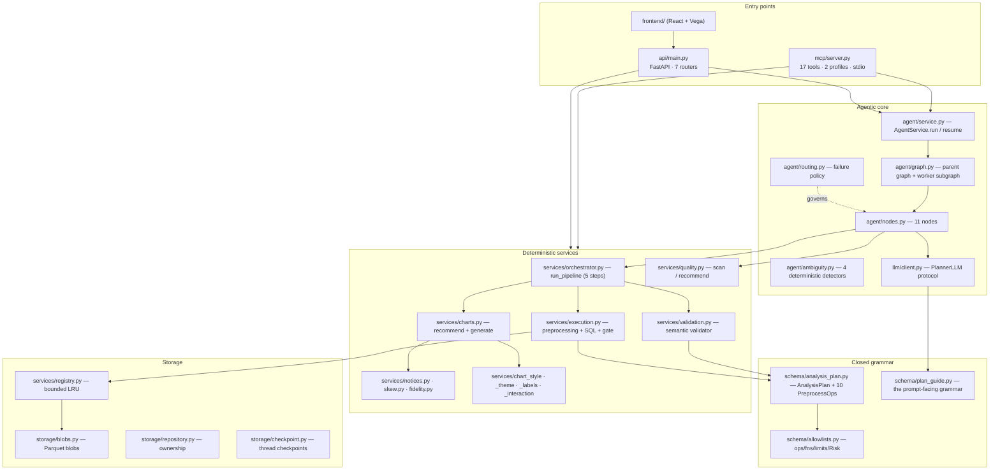
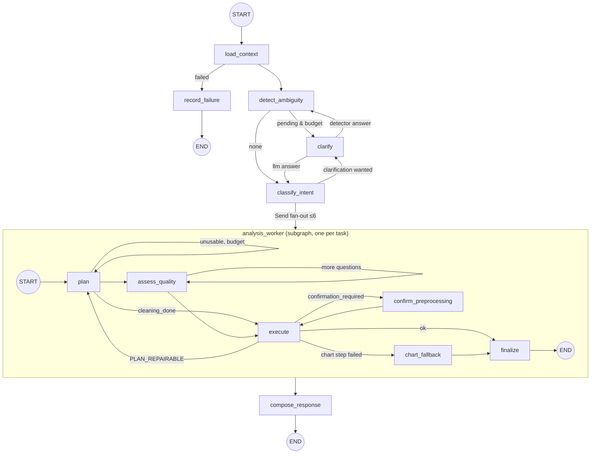

# 18 — Complete Component Reference (Agentic Workflow, End to End)

A component-by-component walkthrough of AutoViz as **implemented in code**, from a CSV
landing on disk to a themed Vega-Lite spec and a grounded sentence. Every claim below is
traceable to a file and, where it matters, to a constant.

This document complements the design docs (`06` MCP plan, `08` agentic workflow, `09`
system architecture, `10` validation/security). Where those state intent, this states
mechanics: what runs, in what order, with what numbers.

---

## Table of contents

1. [The one-paragraph model](#1-the-one-paragraph-model)
2. [Layer map and module inventory](#2-layer-map-and-module-inventory)
3. [Entry points](#3-entry-points)
4. [Stage 1 — Dataset ingestion and profiling](#4-stage-1--dataset-ingestion-and-profiling)
5. [Stage 2 — The dataset registry](#5-stage-2--the-dataset-registry)
6. [Stage 3 — The LangGraph workflow](#6-stage-3--the-langgraph-workflow)
7. [Stage 4 — Ambiguity detection and clarification](#7-stage-4--ambiguity-detection-and-clarification)
8. [Stage 5 — Planning (the LLM's only job)](#8-stage-5--planning-the-llms-only-job)
9. [Stage 6 — Data quality: scan → recommend → decide](#9-stage-6--data-quality-scan--recommend--decide)
10. [Stage 7 — Plan validation](#10-stage-7--plan-validation)
11. [Stage 8 — Preprocessing execution, op by op](#11-stage-8--preprocessing-execution-op-by-op)
12. [Stage 9 — The row-removal confirmation gate](#12-stage-9--the-row-removal-confirmation-gate)
13. [Stage 10 — Query compilation and execution](#13-stage-10--query-compilation-and-execution)
14. [Stage 11 — Chart selection and generation](#14-stage-11--chart-selection-and-generation)
15. [Stage 12 — Disclosure (notices, skew, fidelity)](#15-stage-12--disclosure-notices-skew-fidelity)
16. [Stage 13 — Composition and the final envelope](#16-stage-13--composition-and-the-final-envelope)
17. [Error taxonomy and the routing policy it drives](#17-error-taxonomy-and-the-routing-policy-it-drives)
18. [Persistence](#18-persistence)
19. [Security posture](#19-security-posture)
20. [Configuration reference](#20-configuration-reference)
21. [Frontend components](#21-frontend-components)
22. [Test map](#22-test-map)
23. [Worked end-to-end trace](#23-worked-end-to-end-trace)

---

## 1. The one-paragraph model

> The **LLM understands and plans**. **LangGraph controls the workflow**. **AutoViz services
> validate and execute**. **DuckDB calculates**. **Vega-Lite renders**. **MCP exposes**.

No number in a returned chart was produced by a language model. The planner emits a JSON
`analysis_plan` in a **closed grammar**; that plan is semantically validated against the
dataset's profiled schema; the validated plan is compiled to parameterized SQL; DuckDB runs it;
the resulting table drives a structurally validated Vega-Lite spec. The exact SQL text ships
back in `provenance.sql`.

The three things the workflow will **stop and ask** about are: an ambiguous request, a
value-changing cleaning choice, and a cleaning step that would remove a large share of rows.
Everything else runs to completion or fails with a typed error code.

---

## 2. Layer map and module inventory



### Backend module inventory

| Path | Lines | Responsibility |
|---|---:|---|
| `agent/graph.py` | 104 | Graph assembly: parent graph + compiled worker subgraph |
| `agent/state.py` | 151 | `AutoVizState`, `WorkerState`, reducers, all loop budgets |
| `agent/nodes.py` | 530 | The 11 nodes; the only places `interrupt()` is called |
| `agent/routing.py` | 160 | Every conditional edge; the failure policy in one file |
| `agent/ambiguity.py` | 287 | 4 deterministic detectors + `apply_resolutions` |
| `agent/service.py` | 256 | Sync facade; interrupt **grouping** across parallel workers |
| `llm/client.py` | 297 | `PlannerLLM` protocol + `GeminiPlanner`; 4 system prompts |
| `schema/analysis_plan.py` | 467 | `AnalysisPlan`, 10 preprocessing op models, consent hash |
| `schema/allowlists.py` | 118 | Closed op/fn sets, `Risk` enum, every ceiling |
| `schema/plan_guide.py` | 140 | The grammar document shared by MCP + internal planner |
| `schema/clarification.py` | 153 | `Ambiguity`, `ClarificationOption`, `bind_answer` |
| `schema/chart_style.py` | 76 | What a user may override on a finished spec |
| `services/orchestrator.py` | 212 | `run_pipeline` — validate → execute → recommend → generate |
| `services/execution.py` | 950 | Preprocessing CTE chain, SQL builder, governors, gate |
| `services/validation.py` | 506 | Semantic validation against the profiled schema |
| `services/quality.py` | 617 | Deterministic quality scan and cleaning recommendations |
| `services/dataset.py` | 343 | Register / schema / profile / preview; sanitisation |
| `services/registry.py` | 154 | Bounded, self-loading LRU of DataFrames |
| `services/charts.py` | 413 | Rule-based recommender + Vega-Lite generator |
| `services/skew.py` | 213 | Axis/colour rescaling decisions for compressed charts |
| `services/notices.py` | 280 | Disclosure prose, written in Python (never paraphrased) |
| `services/fidelity.py` | 221 | "What was asked for and is not here" |
| `services/chart_theme.py` | 134 | Baked-in palette + chrome |
| `services/chart_labels.py` | 165 | Direct labels (accessibility obligation) |
| `services/chart_interaction.py` | 231 | Tooltip / hover / legend filter / brush / zoom |
| `services/chart_style.py` | 206 | Applying a user's style block to a finished spec |
| `services/safety.py` | 62 | Prompt-injection neutralisation for untrusted text |
| `services/export.py` | 79 | Self-contained HTML export |
| `errors.py` | 131 | Typed error taxonomy + three response classes |
| `observability.py` | 175 | One structured record per tool call / graph event |
| `mcp/server.py` | 521 | Tool registration, profiles, resources, prompts |
| `mcp/envelope.py` | 130 | The `isError` policy |
| `mcp/results.py` | 371 | Pydantic output models (real `outputSchema`) |

---

## 3. Entry points

### 3.1 MCP server (`mcp/server.py`)

Transport: stdio (`python -m autoviz.mcp`). **stdout is reserved for JSON-RPC** — all logging
goes to stderr and a rotating file (`observability.py`).

Two profiles, selected by `AUTOVIZ_MCP_PROFILE` (default `advanced`):

| Profile | Tools |
|---|---|
| `default` (6) | `register_dataset`, `list_datasets`, `analyze_data_quality`, `run_analysis_pipeline`, `analyze`, `export_chart` |
| `advanced` (17) | the above **plus** `unregister_dataset`, `get_dataset_schema`, `get_dataset_profile`, `preview_dataset`, `preview_preprocessing`, `materialize_cleaned_dataset`, `validate_analysis_plan`, `execute_analysis`, `recommend_chart_type`, `generate_chart`, `answer_clarification` |

The rationale for the narrow default is written into the file: a host's LLM must choose between
these on every turn, and overlapping abstraction levels ("`execute_analysis` or
`run_analysis_pipeline` or `analyze`?") make that choice noisier.

**Resources** (published once, not repeated in every tool description):

- `autoviz://docs/analysis-plan-guide` — the full plan grammar (~5.2k chars). Embedding it in
  three tool descriptions put 83% of the `tools/list` payload on the wire at every session init.
- `autoviz://datasets`, `autoviz://datasets/{id}/schema`, `autoviz://datasets/{id}/profile`

**Prompt**: `analyze_dataset(file_ref, question)` — a guided 5-step flow.

**Long-running work** (`_run_cancellable`): the blocking pipeline runs in a worker thread via
`anyio.to_thread.run_sync(..., abandon_on_cancel=True)`. Progress callbacks are marshalled
back to the event loop as MCP progress notifications ("Executing query — step 3 of 5"); a host
cancellation sets a `threading.Event` that interrupts the live DuckDB query.

### 3.2 FastAPI gateway (`api/main.py`)

| Prefix | Router | Auth |
|---|---|---|
| `/auth` | `auth.py` (+ `oauth.py`) | — |
| `/datasets` | `datasets.py` | Bearer, owner-scoped |
| `/analysis` | `analysis.py` | registry-scoped |
| `/charts` | `charts.py` | Bearer for persisted + `/style` |
| `/dashboards` | `dashboards.py` | Bearer, owner-scoped |
| `/conversations` | `conversations.py` | Bearer, owner-scoped |
| `/agent` | `agent.py` | Bearer, owner-scoped |
| `/health` | inline | — |

Auth is **Bearer token**, not cookies: `/auth/login` mints an opaque token in the `sessions`
table; `get_current_user` resolves `Authorization: Bearer <token>` on every protected route.

Lifespan hook wires `REGISTRY.loader = blobs.make_loader()` — this is what makes a dataset
survive eviction or a restart without the `services` package importing `storage`.

Every route body goes through `api/errors.respond()`, which maps the shared failure shapes onto
HTTP status codes. The `/agent` routes deliberately respond **200** and let the envelope's own
`status` carry the workflow outcome, mirroring the MCP tools.

### 3.3 Agent facade (`agent/service.py`)

```python
AgentService.run(request, dataset_id=None, file_ref=None,
                 thread_id=None, chart_id=None, chart_type=None)
AgentService.resume(thread_id, answer, interrupt_id=None)
```

`run` resets the per-run keys that would otherwise persist in the thread checkpoint
(`target_chart_id`, `preferred_chart_type`, `chart_results`, all clarification state). Leaving
last turn's chart target behind would silently overwrite an unrelated chart.

**Interrupt grouping** is this module's distinctive job. Parallel workers can pause in the same
superstep, so a pause is presented as a *decision*, not as one worker's interrupt:

| `pause_kind` | Group key | Why that key |
|---|---|---|
| `confirmation` | `preprocessing_hash` | hashes `{dataset_id, preprocessing}`; equal hash ⇒ identical question **and** answer semantics |
| `cleaning_choice` | `slot` | proposals are per-`(dataset, column)`; the plan only decides *whether* one surfaces |
| `clarification` | question text | runs in the parent graph before fan-out, so never concurrent |

The client-facing `interrupt_id` is a synthetic 16-hex token (`sha256(kind|seed)`), because a
group has *N* LangGraph ids and those re-hash across checkpoints.

`_live_from_snapshot` filters `snapshot.tasks` on `task.result is None`. This is necessary:
LangGraph never deletes a task's `INTERRUPT` pending write when the task later succeeds, so
`snapshot.interrupts` shows answered interrupts forever.

Resume always sends a **map** (`Command(resume={id: answer for id in group.ids})`), never a bare
value — once any resume-map has been used on a thread, a bare resume trips LangGraph's
"multiple pending interrupts" guard.

---

## 4. Stage 1 — Dataset ingestion and profiling

`services/dataset.py` · `register_dataset(file_ref) → {dataset_id, row_count, column_count}`

### 4.1 Path resolution

```
absolute path  → used as-is (host-provided)
relative path  → resolved against DATA_ROOTS only, and the resolved path
                 must stay inside its root (traversal rejected)
```

`DATA_ROOTS` defaults to `<repo>/test-data` and `<repo>`; override with `AUTOVIZ_DATA_ROOTS`
(os.pathsep-separated).

### 4.2 Pre-read guards — enforced *before* the file is trusted into memory

| Check | Limit | Env override | Error |
|---|---|---|---|
| File size (`stat`, before read) | 50 MiB | `AUTOVIZ_MAX_FILE_BYTES` | `RESOURCE_LIMIT` |
| Column count (from header only, `nrows=0`) | 512 | `AUTOVIZ_MAX_COLUMNS` | `RESOURCE_LIMIT` |
| Row count (after read) | 1,000,000 | `AUTOVIZ_MAX_ROWS` | `RESOURCE_LIMIT` |
| Non-empty | ≥1 row, ≥1 column | — | `FILE_ERROR` |

The byte cap is the real memory guard — `pd.read_csv` would otherwise load the whole file
before any check could run.

### 4.3 `build_record` — typing, profiling, identity

Shared by `register_dataset` **and** `materialize_cleaned_dataset`, so a cleaned copy is
profiled by exactly the same code as a fresh upload.

**Step 1 — datetime coercion** (`_coerce_datetimes`): an object/string column is promoted to
datetime only when **every** non-null value parses (`format="mixed"`). Partial parses are left
as strings, avoiding misreading plain text as dates.

**Step 2 — logical types** (`_logical_type`), the four-value vocabulary used everywhere
downstream:

```
boolean → is_bool_dtype
number  → is_numeric_dtype
datetime→ is_datetime64_any_dtype
string  → everything else
```

**Step 3 — coded categoricals** (`_categorical_numeric_columns`): a `number` column qualifies
as a *coded category* when every non-null value is a whole number **and** distinct count
≤ `CATEGORICAL_NUMERIC_MAX_CARDINALITY` (20).

- Catches `pclass` (1/2/3), `survived` (0/1), `sibsp` (0–8).
- Excludes `fare` (fractional values) and `age` (too many distinct integers).
- **The stored dtype is never changed.** The flag only informs chart encoding (nominal vs
  quantitative) and only where the column is used as a *dimension* — see §14.

**Step 4 — the profile** (`_build_profile`):

| Key | Contents | Consumed by |
|---|---|---|
| `null_counts` | per column | `quality.scan` (avoids a second pass) |
| `null_percentage` | rounded to 2dp | UI / planner |
| `unusable_columns` | 100 %-null columns | `validation` rejects use of these |
| `duplicate_count` | `df.duplicated().sum()` | `quality.scan` |
| `cardinality` | distinct per column | planner prompt, metric ranking |
| `summary_stats` | `describe()` on numeric columns | planner |
| `sample_values` | distinct values of categorical columns with cardinality ≤ 50, capped at 50 values | `_detect_value_reference` |
| `categorical_numeric` | step 3 | planner prompt, chart encoding |
| `lineage` (derived datasets only) | parent_id, version_id, steps, row counts, `confirmed_by_user` | provenance chain |

**Step 5 — neutralisation.** Every string copied *out* of the frame into the profile — column
names included — passes through `safety.neutralize_text`. The real names stay untouched as the
DataFrame/SQL identifiers; only the copies bound for an LLM prompt are defanged. See §19.

**Step 6 — identity**: `dataset_id = "ds_" + sha1(f"{source}:{time.time_ns()}")[:8]`.

### 4.4 Sanitisation on the way out

`_sanitize_scalar` / `sanitize_records` convert every returned cell to an inert JSON scalar:
NaN/±inf → `None`, `pd.Timestamp` → ISO string, numpy scalar → Python scalar, `str` →
neutralised.

---

## 5. Stage 2 — The dataset registry

`services/registry.py` — `dataset_id → DatasetRecord{df, schema, profile, categorical_numeric}`

Two properties beyond the plain dict it started as:

**Bounded.** Frames are evicted least-recently-used once total resident bytes
(`df.memory_usage(deep=True).sum()`) exceed `AUTOVIZ_REGISTRY_MEMORY_BYTES` (default 512 MiB).
`_evict` never drops the **last** remaining record — a single dataset larger than the whole
budget must still be queryable, and evicting the one just added would make `add()` a no-op.

**Self-loading.** A miss calls the injected `loader`, so an evicted (or restart-lost) dataset is
transparently restored from the Parquet blob store. The loader is *injected in the FastAPI
lifespan*, never imported: `storage` depends on `services`, and importing back the other way
would make the analysis services require a database. `loader=None` keeps the pure in-memory
behaviour the MCP server and offline tests use.

Concurrency: an `RLock` (reentrant because `add()` runs inside `get()` on the miss path).
The loader call happens **outside** the lock — restoring means a DB round trip plus a Parquet
decode, and holding the lock would serialise every other dataset's queries behind it. On the
race, the copy already cached wins, so callers never hold divergent frames.

---

## 6. Stage 3 — The LangGraph workflow

### 6.1 Shape



The parent graph runs `StateGraph(AutoVizState)`; the worker is a separate
`StateGraph(WorkerState, output_schema=WorkerOutput)` **compiled and added as a node**. The
output schema is the isolation boundary: only `chart_results` flows back, so worker internals
(plans, errors, attempt counters) cannot collide across parallel workers.

Fan-out is `langgraph.types.Send`, one per task, from `route_after_classify`.

### 6.2 State

`AutoVizState` (parent):

| Key | Purpose |
|---|---|
| `user_request`, `dataset_id` | the request |
| `schema`, `profile` | loaded context |
| `intent` | `analysis` \| `refinement` \| `clarification` |
| `target_chart_id` | a chart the caller pointed at explicitly — authoritative where set |
| `preferred_chart_type` | a type picked from a list (not described in prose) |
| `tasks` | ≤ `MAX_TASKS` self-contained sub-requests |
| `pending_ambiguities`, `resolved_slots`, `clarify_source`, `clarification_count` | clarification loop |
| `chart_results` | `Annotated[..., add_or_reset]` — workers append; `None` resets for a new run on the same thread |
| `history` | `Annotated[..., append_history]` — cross-run memory for refinements |
| `status`, `errors`, `final_response` | output |

`WorkerState` adds `prior_plan`, `refines_chart_id`, `analysis_plan`, `rejected_plan`,
`validation_errors`, `plan_attempts`, `approved_preprocessing_hash`, `confirmation_count`,
`cleaning_resolutions`, `cleaning_prompts`, `cleaning_done`, `applied_cleaning`,
`pipeline_output`, `fallback_chart`.

> **Only identifiers, metadata, plans and bounded results enter state — never DataFrames.**

### 6.3 Every loop carries a budget

| Constant | Value | Bounds |
|---|---:|---|
| `MAX_TASKS` | 6 | parallel workers per request (⇒ concurrent planner calls, concurrent pauses) |
| `MAX_PLAN_ATTEMPTS` | 2 | repairs after the first plan ⇒ ≤3 planner calls per task |
| `MAX_CLARIFICATIONS` | 2 | clarification rounds per run (detectors + LLM combined) |
| `MAX_CLEANING_PROMPTS` | 2 | cleaning questions per worker |
| `MAX_CONFIRMATIONS` | 2 | row-removal confirmation rounds per worker |
| `MAX_EXEC_RETRIES` | 1 | in-place retries for `RETRYABLE` faults, backoff 0.25 s × attempt |

Past a cleaning budget the remaining issues are left **untouched** — the safe default is that
no value changes without an answer.

### 6.4 Node reference

| Node | Graph | What it does | Can pause? |
|---|---|---|---|
| `load_context` | parent | schema + profile from the registry; `status: failed` on unknown dataset | no |
| `detect_ambiguity` | parent | runs the 4 deterministic detectors minus resolved slots | no |
| `clarify` | parent | asks **one** question; binds the answer deterministically | **yes** (`clarification`) |
| `classify_intent` | parent | LLM: intent + task split (+ optional LLM clarification) | no |
| `compose_response` | parent | LLM summary + **enforced** disclosure append + history entry | no |
| `record_failure` | parent | terminal failure envelope | no |
| `plan` | worker | LLM → `analysis_plan`; `dataset_id` is overwritten server-side | no |
| `assess_quality` | worker | scan → auto-apply safe ops → ask about one value-changing op | **yes** (`cleaning_choice`) |
| `execute` | worker | `run_pipeline` + bounded retry of infrastructure faults | no |
| `confirm_preprocessing` | worker | presents the row-removal gate, binds proceed/skip | **yes** (`confirmation`) |
| `chart_fallback` | worker | one plain bar chart when the chart step failed after a good query | no |
| `finalize` | worker | assembles the `ChartResult`, incl. fidelity notices | no |

Two details in `plan_node` and `finalize_worker` worth calling out:

- `plan["dataset_id"] = state["dataset_id"]` — *never trust the LLM with ids.*
- `chart_id = refines_chart_id or f"ch_{uuid4().hex[:12]}"` — a refinement **inherits** the id
  of the chart it refines, which is what lets a host replace a card instead of appending a
  near-duplicate.

### 6.5 Routing policy (`agent/routing.py`)

The failure policy lives entirely here, not in the nodes.

**Refinement targeting**, in precedence order:

1. `target_chart_id` present and found anywhere in history → that chart's plan becomes
   `prior_plan`; if there's exactly one task, `refines_chart_id` is set. *Pointing at a chart is
   the statement of intent, so the classifier's reading gets no vote.*
2. `intent == "refinement"` with no usable target → `_most_recent_chart(history)`. The only
   guess available; right for the common single-chart case.
3. Otherwise → new chart(s).

`_chart_in_history` searches **every** entry in reverse, not just the newest, because a chart
the user pointed at may be several requests old — that is the whole reason for pointing at it.

**After execute** (`route_after_execute`):

```
status ok                     → finalize
status confirmation_required  → confirm_preprocessing (if budget) else finalize
error_code in PLAN_REPAIRABLE → plan (if budget)          # INVALID_PLAN, TYPE_MISMATCH
failed_step in CHART_FALLBACK_STEPS → chart_fallback      # recommend_chart_type, generate_chart
otherwise                     → finalize
```

Infrastructure faults never reach here as a replan — `execute_node` already retried them in
place. Replanning a `TIMEOUT` would burn the plan budget regenerating a plan that was never
the problem.

---

## 7. Stage 4 — Ambiguity detection and clarification

`agent/ambiguity.py` + `schema/clarification.py` (Direction B)

The decision *"should we ask?"* is a **computed signal, not a prompt guess** — the detectors run
over `request × schema × profile` **before** the planner LLM.

### 7.1 The four detectors

| Detector | Fires when | Slot | Options grounded in |
|---|---|---|---|
| `_detect_time_column` | request contains a temporal hint **and** ≥2 datetime columns **and** the user named neither | `time_column` | the real datetime columns |
| `_detect_column_reference` | a ≥3-char non-stopword matches the component words of ≥2 column names, with no exact-name match and no full mention | `dimension` | the matching columns |
| `_detect_value_reference` | a literal in the request is a sampled value in ≥2 columns | `filter_value` | `profile.sample_values` |
| `_detect_missing_metric` | a superlative appears with no numeric column named and no aggregation word | `metric` | numeric columns ranked by cardinality, capped at 5, **plus** "Number of records (count)" |

Guards worth noting: a pure datetime clash is skipped by `_detect_column_reference` (it belongs
to the time detector); metric candidates are ranked by cardinality so continuous quantities
(`fare`, `age`) surface above low-signal integer codes when the list is capped.

### 7.2 The loop

```
detect_ambiguity → (pending & count < 2) → clarify → interrupt(...)
                 ↓                              ↓
        classify_intent               bind_answer → resolved_slots
                                              ↓
                                    back to detect_ambiguity (queue shrinks)
```

Answered slots are filtered out on the next detection pass, so the queue monotonically shrinks.
A **detector** answer re-detects; an **LLM** answer re-classifies (`route_after_clarify`).

### 7.3 Deterministic binding (`bind_answer`)

Resolution order, all case/space-insensitive, first match wins:

1. exact option label
2. a scalar inside an option's `resolves_to` (typing the column name works even if the label
   was prettier)
3. label `startswith` / contains the answer (guarded: answer ≥3 chars)
4. free text, carried verbatim
5. `unmatched`

**Binding never calls the LLM.** A clicked option resolves the exact slot that was asked.

### 7.4 Applying resolutions (`apply_resolutions`)

Bound answers become spelled-out clauses appended to the task text the worker plans from:

```
"Which region sold best?"
  + resolved {metric: {column: "revenue", fn: "sum"}}
  → "Which region sold best?  [Resolved constraints: measure by sum of `revenue`]"
```

Deterministic — a clicked option actually steers the plan rather than being re-guessed.

---

## 8. Stage 5 — Planning (the LLM's only job)

`llm/client.py`

The graph never talks to a provider directly; it talks to the `PlannerLLM` **Protocol**, so
tests inject a scripted fake and the provider is swappable via `AUTOVIZ_PLANNER_MODEL` (any
`init_chat_model` id; default `google_genai:gemini-3.5-flash`, `temperature=0`). The chat model
is constructed **lazily**, so importing the server never requires an API key.

Four prompts, four jobs:

| Method | System prompt | Returns | Failure mode |
|---|---|---|---|
| `classify` | `_CLASSIFY_SYSTEM` | `IntentDecision{intent, tasks[], clarification?}` | `PlannerError` → node degrades to a single analysis task |
| `generate_plan` | `_PLAN_SYSTEM` (= `PLAN_GUIDE` + repair rules) | raw plan dict | `PlannerError` → replan or finalize with errors |
| `compose` | `_COMPOSE_SYSTEM` | prose summary | any exception → grounded template fallback |
| `style_patch` | `_STYLE_SYSTEM` | style-diff dict | `PlannerError`/`ValidationError` → route refuses, chart untouched |

**Output parsing** is hardened: `_strip_fences` removes code fences, `_json_object` extracts the
outermost `{...}`, and every parse failure becomes a `PlannerError` — provider exceptions never
escape this module.

**What the planner sees** is deliberately bounded: schema, `column_cardinality`,
`categorical_numeric_columns`, and (for classify) the last 3 history entries. Never the frame.

**Compose's payload** (`condensed`) carries at most 25 result rows per task plus the SQL and the
pre-written `notices` — the last of which is the only reason the composer can mention cleaning
at all.

### The plan grammar (`schema/plan_guide.py` ↔ `schema/analysis_plan.py`)

```jsonc
{
  "dataset_id": "ds_…",              // required; server-overwritten
  "intent": "comparison|trend|distribution|relationship|composition|ranking",
  "preprocessing": [ /* ≤10 ops, see §11 */ ],
  "select": ["col", …],
  "filters": [{"column","op","value"}],   // 11 ops
  "derive":  [{"name","from","fn"}],      // 9 fns
  "group_by": ["c1","c2"],                // max 2
  "aggregations": [{"column","fn","as"}], // 7 fns
  "sort": [{"by","dir"}],
  "limit": 1‥100000 | null,
  "chart": {"type","x","y","color"}       // 10 types; omit to auto-recommend
}
```

Allow-lists are enforced **structurally at parse time** via `Literal` types (`_StrictModel` sets
`extra="forbid"`), and semantically in `services/validation.py`. There is no raw-expression
fallback — anything outside the lists is a validation *failure*, never a warning.

`limit: null` means "everything up to the hard ceiling". This matters: a small default would
silently truncate distribution/relationship queries whose *rows are* the chart data.

---

## 9. Stage 6 — Data quality: scan → recommend → decide

`services/quality.py` — **deliberately not an LLM.** What is wrong with a column and what the
sensible repair is are computable from the data, which makes the recommendation reproducible and
testable against exact counts.

Everything is **scoped to the columns the current analysis needs**
(`AnalysisPlan.referenced_columns()`). A filthy `comments` column is not a reason to interrupt a
question about revenue, and scanning the whole frame every time would make the interruption rate
a function of the dataset rather than of the request.

### 9.1 `scan(record, columns) → list[QualityIssue]`

| `kind` | Condition | `affected` |
|---|---|---|
| `missing_values` | any nulls (reuses `profile.null_counts`) | null count |
| `untrimmed_whitespace` | *(string)* `text != text.strip()` | row count |
| `blank_as_text` | *(string)* stripped value is `""` | row count |
| `case_variants` | *(string)* case-folding **actually merges groups** (`folded < distinct`) | rows not already lower-case |
| `high_cardinality` | *(string)* no case variants **and** distinct > `HIGH_CARDINALITY` (25) | distinct count |
| `empty_rows` | all-null rows — **whole-frame scans only** | row count |
| `duplicate_rows` | `profile.duplicate_count` — **whole-frame scans only** | count |

The whole-row checks are gated on `columns is None or set(df.columns) <= set(targets)`. Reporting
"9 duplicate rows" from a scoped scan would put a finding in front of a user whose duplication
may be entirely explained by the columns not examined.

`case_variants` is an `elif` against `high_cardinality` on purpose: a column with 200 spellings
that fold to 12 is a case problem, not a cardinality problem, and fixing the case first may
remove the cardinality finding entirely.

### 9.2 `recommend(issues, total_rows, measure) → (auto_ops, proposals)`

The split is **by who is allowed to decide**, and the axis is the `Risk` tier declared on each
op model (`schema/allowlists.Risk`):

| Tier | Meaning | Handling |
|---|---|---|
| `SAFE` | semantics-preserving — the corrected data means what the original meant | applied automatically, **reported** |
| `VALUE_CHANGING` | alters values or row membership, so can alter the result | **always** asked, at any fraction |
| `AMBIGUOUS` | correctness not determinable from the data alone | never auto-proposed; only on explicit request |

> Percentage is the **secondary** axis: it escalates *within* a tier but never demotes one.
> Changing 1 % of a revenue column can move a total; trimming whitespace from 80 % of labels
> changes nothing.

**`auto_ops` (SAFE, applied silently but disclosed):**

- `trim_whitespace` — one op covering *all* untrimmed columns (grouped, so eight separate trim
  steps don't burn the 10-step budget)
- `empty_string_to_null` — likewise grouped
- `normalize_case` — one per column with merging case variants
- `drop_empty_rows` — whole-frame

**`proposals` (questions), sorted most-impactful-first by `issue.fraction`:**

| Slot | Options (recommended one in **bold**) |
|---|---|
| `missing:{col}` | fill (`median` for numeric / `mode` for categorical) · **exclude those rows** · keep as-is<br/>→ *fill* becomes the recommendation instead when `fraction > 0.30`, because excluding would cost most of the data |
| `cardinality:{col}` | **top 10 + "Other"** (`group_rare_categories`) · show every value |
| `duplicates` | **keep them** · count each row once |

The duplicate default is the clearest case where "obviously dirty" and "actually wrong" come
apart: two sales of the same item at the same price on the same day are legitimately identical
rows.

Each `CleaningOption` carries three separate strings, so a host can lead with plain language:

```python
CleaningOption(
  label     = "Use the typical fare value",              # what happens
  detail    = "Fills 177 missing value(s) with the middle fare.",  # what it costs, in real rows
  technique = "median imputation on 'fare'",             # the jargon — put it behind a disclosure
  op        = {"op": "fill_nulls", "column": "fare", "strategy": "median"},
  recommended = False,
)
```

### 9.3 `is_worth_asking(proposal, dimensions)` — the interruption filter

Every proposal is a legitimate decision, but not every one changes what the user would see, and
a question that cannot change the answer is just friction.

| Issue | Column role | Ask? | Why |
|---|---|---|---|
| `missing_values` | **dimension** (`group_by` / `chart.color`) | **yes** | nulls become a visible "null" category next to the real ones |
| `missing_values` | measure | no | aggregates already skip nulls, and the exclusion is disclosed in `provenance.implicit_null_exclusions` |
| `missing_values` | selected, not aggregated | no | nulls are not plotted; dropping them yields an identical chart |
| `high_cardinality` | dimension | **yes** | 200 distinct values make an unreadable *axis* |
| `high_cardinality` | filter only | no | irrelevant to what is drawn |
| `duplicate_rows` | — | **always** | whether repeated rows are real events is not something the data can answer |

### 9.4 `merge_auto_ops(existing, auto)` — folding repairs into the planner's plan

Two rules, both about **not overriding a person**:

1. A repair is dropped for any column the plan already applies the **same kind** of op to. Same
   *kind*, not same column — an explicit `drop_nulls` on `age` says nothing about whether `age`
   should be trimmed, and treating any mention of a column as "hands off" would silently disable
   most repairs.
2. Repairs are **prepended**. They fix how values are *written*, so they must run before the ops
   that decide which rows survive — trimming after a `drop_nulls` on the same column is too late
   to matter.

The `MAX_PREPROCESSING_STEPS` (10) cap falls on **suggestions only**; the planner's ops are
always kept in full. A wide messy CSV producing a `normalize_case` per column must not push the
block over the limit and fail validation on a plan the user wrote correctly.

### 9.5 `suppressed_slots(existing)` — respecting instructions already given

An LLM plan that says "fill missing age with the median" *is* the user's instruction reaching the
planner. Asking again would re-litigate a decision they already made.

```
fill_nulls / drop_nulls on col   → suppresses "missing:{col}"
drop_exact_duplicates            → suppresses "duplicates"
group_rare_categories on col     → suppresses "cardinality:{col}"
```

The last one matters for refinements: a follow-up carries the prior plan's preprocessing
forward, so without it the cardinality slot would be unsuppressable and every follow-up would
re-ask an answered question.

### 9.6 `bind_cleaning_answer(proposal, answer)`

Exact label → unique prefix match → **the do-nothing option**. An unreadable answer resolves to
*inert*, never to the recommendation: the recommendation is a default for someone who clicked
it, not a licence to apply a value-changing op off a reply we could not parse.

### 9.7 The `assess_quality` node loop

```python
1. validate the plan enough to know which columns it reads
2. scope   = referenced_columns ∩ record.schema
3. issues  = quality.scan(record, scope)
4. auto, proposals = quality.recommend(issues, len(df), plan_measure(model))
5. answered = cleaning_resolutions ∪ suppressed_slots(plan.preprocessing)
6. pending  = [p for p in proposals if p.slot not in answered and is_worth_asking(p, dims)]
7. plan.preprocessing = merge_auto_ops(existing, auto) + [chosen ops]
8. if not pending or cleaning_prompts >= 2:  → cleaning_done = True → execute
   else: interrupt(one question) → bind → loop back to assess_quality
```

Resulting op order in the plan: **[safe auto-repairs] → [planner's own ops] → [user-chosen ops]**.
Safe repairs must be in place before the value-changing ops (the user's included) decide which
rows survive.

`cleaning_done` is sticky, so a replan does not restart the questioning; `cleaning_resolutions`
persists across replans so an answered slot is never asked twice.

`plan_measure(model)` picks the `(column, fn)` the chart actually plots (matching `chart.y`
against aggregation aliases, else the first aggregation). It exists for one reason: a `top_n`
ranked by row frequency buries the top *earner* in "Other" whenever volume and value disagree.

---

## 10. Stage 7 — Plan validation

`services/validation.py` — the safety layer. **Failures are errors, never warnings.**

`validate_analysis_plan(dataset_id, plan, registry) → {valid, errors[], error_code?, repaired_plan?}`

### Order of checks

```
0. registry lookup                       → UNKNOWN_DATASET
1. AnalysisPlan.model_validate           → INVALID_PLAN (structural, closed grammar)
2. fully-null column detection           (only the referenced columns — bounded work)
3. _validate_preprocessing               (against the RAW schema — cleaning runs first)
4. effective = schema ∪ cast overrides   (a cast column IS its new type from here on)
5. derive     — source exists, fn↔type compatible, name not code-like
6. select     — exists, not fully null
7. filters    — op allow-listed, type contract, value shape/arity, injection screen
8. group_by   — exists, not fully null
9. aggregations — fn allow-listed, numeric-only contract, alias not code-like
10. sort      — `by` must be produced by the query
11. limit     — > MAX_LIMIT is the ONE deterministic repair (clamped)
12. chart     — channels reference produced columns; per-type contracts
```

### Type contracts enforced

| Contract | Rule |
|---|---|
| `NUMERIC_ONLY_AGGS` = sum/mean/min/max/median | numeric column required |
| `DATE_DERIVE_FNS` = month/year/day/weekday | datetime source required |
| `STRING_DERIVE_FNS` = lower/upper/trim | string source required |
| `NUMERIC_DERIVE_FNS` = round/abs | numeric source required |
| `STRING_ONLY_OPS` = contains | string column required |
| `ORDERED_OPS` = gt/gte/lt/lte/between | numeric or datetime required |
| `NULL_OPS` = is_null/is_not_null | any type; **takes no value** |
| `LIST_VALUE_OPS` = in/between | `in`: 1–20 scalars; `between`: exactly 2 |

### Chart-type contracts

| Type | Rule |
|---|---|
| `histogram` | **no** `y` (y is the binned count); `x` must be numeric |
| `boxplot` | **refused over an aggregating plan** — quartiles need raw values; `y` numeric |
| `heatmap` | `color` **required and numeric** — the one type whose colour is the measure |
| `grouped_bar` | `color` required (it carries the series) |
| everything else | `y` required |

### Error-code sharpening

`_plan_error_code`: if **every** error contains a type-mismatch marker → `TYPE_MISMATCH`; any
structural error → `INVALID_PLAN`. Both are plan-repairable, so this only sharpens diagnostics.

### `fill_nulls` constant values (`_fill_value_errors`)

Constants are **bound as SQL parameters**, so a code-looking string is ordinary data. What is
validated instead is: scalarity, finiteness, length ≤ `MAX_FILL_STRING_LEN` (256), and
destination-column compatibility (`bool` is checked *before* `int`, since `bool` subclasses
`int` in Python). A datetime constant is parsed **here** — `pd.to_datetime(..., errors="coerce")`
— because letting DuckDB raise would surface as a *retryable* `EXECUTION_ERROR`, sending the
agent into a backoff loop re-running a deterministically failing plan.

### The `else: reject` defaults

Both `_validate_preprocessing` and `_apply_preprocessing` end with an explicit rejection branch
for an unrecognised op. This is unreachable through the closed grammar, and deliberate: an op
added to the `PreprocessOp` union without a validation rule would otherwise be accepted with **no
semantic checks at all**.

---

## 11. Stage 8 — Preprocessing execution, op by op

`services/execution.py :: _apply_preprocessing`

### 11.1 The model

Preprocessing compiles into a **parameterized CTE chain over an immutable source**:

```sql
WITH _pp_0 AS (SELECT * REPLACE (trim("name") AS "name") FROM df_raw),
     _pp_1 AS (SELECT * FROM _pp_0 WHERE "fare" IS NOT NULL),
     _pp_2 AS (SELECT * REPLACE (coalesce("age", ?) AS "age") FROM _pp_1),
     base  AS (SELECT * FROM _pp_2)
SELECT "class", avg("fare") AS "average_fare" FROM base
GROUP BY "class" LIMIT 100000
```

Properties this buys:

- `record.df` is **never mutated** — only views are built. `con.register("df_raw", record.df)`.
- Ops run **in listed order**, each seeing the previous one's output. Order is genuinely
  semantic (`fill_nulls` then `drop_exact_duplicates` collapses rows the reverse order keeps).
- Row counts are taken over each **CTE prefix**, so every step reports its exact effect.
- Every literal is a **bound parameter**; every identifier is quoted via `_q` (`"` doubled).
- The cleaned frame is a *recipe*, not a copy — reproducible from (immutable source, ops), which
  is why nothing is stored unless `materialize_cleaned_dataset` is called explicitly.

Returns `(cte_defs, params, final_relation, report, input_rows, output_rows)`.

### 11.2 The ten operations

Legend: **R**=removes rows · risk tier from the op model.

#### `trim_whitespace` — SAFE, no row change
```sql
_pp_i AS (SELECT * REPLACE (trim("c1") AS "c1", trim("c2") AS "c2") FROM prev)
```
`rows_affected` counted with `IS DISTINCT FROM`, so a null on either side counts as a change
rather than swallowing the comparison.

#### `empty_string_to_null` — SAFE, no row change
```sql
_pp_i AS (SELECT * REPLACE (nullif(trim("c"), '') AS "c") FROM prev)
```
`trim` sits *inside* `nullif` so `"   "` counts as empty **without** also rewriting merely-padded
values — trimming is a separate, explicit op.

#### `normalize_case` — SAFE, no row change
```sql
_pp_i AS (SELECT * REPLACE (lower("c") AS "c") FROM prev)
```
Safe because lower-casing can only ever merge values that differ by nothing but case. Whether
it is *worth* doing is the recommender's call, and it only proposes it when folding actually
collapses variants.

#### `drop_empty_rows` — SAFE **and R** (the two flags are orthogonal)
```sql
_pp_i AS (SELECT * FROM prev WHERE "c1" IS NOT NULL OR "c2" IS NOT NULL OR …)
```
A row with no values carries no information, so dropping it preserves meaning — yet it still
counts toward the >30 % backstop, which is what would catch a file that is mostly blank lines.

#### `cast_column` — SAFE, no row change
```sql
-- admissibility, measured against the WORKING VIEW not the raw frame:
SELECT count("c"), count(TRY_CAST("c" AS DOUBLE)) FROM prev
-- if convertible < present:  raise PreprocessError  (refuse, do not null values)
_pp_i AS (SELECT * REPLACE (TRY_CAST("c" AS DOUBLE) AS "c") FROM prev)
```
Targets: `number` → `DOUBLE`, `datetime` → `TIMESTAMP`. Casting to string is never a repair and
is not offered.

Two decisions here: **(a)** admissibility is checked against the working view because casting
*after* `empty_string_to_null` is the normal shape, and a raw-frame check would reject exactly
the plans written correctly. **(b)** A partial cast is **refused**, not coerced — silently
nulling values is data loss dressed up as a repair.

#### `drop_nulls` — VALUE_CHANGING, **R**
```sql
-- how="any":  drop if ANY listed column is null  ⇒ keep where ALL are NOT NULL
_pp_i AS (SELECT * FROM prev WHERE "c1" IS NOT NULL AND "c2" IS NOT NULL)
-- how="all":  drop only if ALL are null          ⇒ keep where ANY is NOT NULL
_pp_i AS (SELECT * FROM prev WHERE "c1" IS NOT NULL OR  "c2" IS NOT NULL)
```

#### `fill_nulls` — VALUE_CHANGING, no row change
```sql
-- 1. count what will be imputed
SELECT count(*) FROM prev WHERE "c" IS NULL
-- 2. compute the fill value at THIS stage of the chain
--    constant → the validated literal
--    median   → SELECT median("c") FROM prev
--    mode     → SELECT "c" FROM prev WHERE "c" IS NOT NULL
--               GROUP BY "c" ORDER BY count(*) DESC, "c" ASC LIMIT 1
-- 3. apply
_pp_i AS (SELECT * REPLACE (coalesce("c", ?) AS "c") FROM prev)
```
`mode` uses an explicit **deterministic tie-break** (highest frequency, then smallest value) —
never DuckDB's `mode()`, which is arbitrary on ties. A `median`/`mode` that comes back `None`
means the column is entirely null at this stage → `PreprocessError` (surfaced as
`INVALID_PLAN`, i.e. plan-repairable, not a retryable environment fault).

> Imputation keeps every row, so it **never trips the row-removal gate** — which is exactly why
> it needs the `VALUE_CHANGING` tier to get consent on its own terms.

#### `drop_exact_duplicates` — VALUE_CHANGING, **R**
```sql
_pp_i AS (SELECT DISTINCT * FROM prev)
```

#### `clean_categories` — VALUE_CHANGING, no row change
```sql
-- count of rows the mapping names
SELECT count(*) FROM prev WHERE "c" IN (?, ?, …)
_pp_i AS (SELECT * REPLACE (CASE "c" WHEN ? THEN ? WHEN ? THEN ? ELSE "c" END AS "c") FROM prev)
```
One CASE arm per mapping entry (≤ `MAX_CATEGORY_MAPPING` = 50), every literal bound. Unnamed
values fall through unchanged. **Only ever explicit** — the recommender never infers a mapping
by fuzzy similarity, because "UK"/"U.K."/"United Kingdom" is obvious to a person and a guess to
a program, and a wrong guess silently merges two real categories.

#### `group_rare_categories` — VALUE_CHANGING, no row change

Two mutually exclusive modes (exactly one must be given):

*`min_frequency`* — a window count, no keep-set needed:
```sql
CASE WHEN "c" IS NULL THEN NULL
     WHEN count(*) OVER (PARTITION BY "c") >= ? THEN "c"
     ELSE ? END
```

*`top_n`* — bounded keep-set, so an IN list is cheap:
```sql
-- keep-set, ranked by the plan's own measure when it has one, else row frequency
SELECT "c" FROM prev WHERE "c" IS NOT NULL
GROUP BY "c" ORDER BY sum("revenue") DESC NULLS LAST, "c" ASC LIMIT ?
-- then
CASE WHEN "c" IS NULL THEN NULL WHEN "c" IN (?,?,…) THEN "c" ELSE ? END
```

Two properties: **nulls are never bucketed** (missing is not the same as rare — folding them
into "Other" would turn an absence into a category), and `rank_by` defaults to row frequency
only when nothing better was given. Same deterministic tie-break as `mode`.

### 11.3 Op-behaviour declaration

Each op model declares its own behaviour, and `__init_subclass__` makes omitting either a
**definition-time `TypeError`**:

```python
class DropNulls(_PreprocessOpBase):
    removes_rows: ClassVar[bool] = True
    risk:         ClassVar[Risk] = Risk.VALUE_CHANGING
    def columns_touched(self) -> set[str]: return set(self.columns)
```

This matters because every consequence of getting it wrong **fails open**: an op not recognised
as row-dropping would skip the confirmation gate, survive "Skip cleaning", and be dropped from
the validator's column checks. Declaring behaviour once, next to the fields it describes, makes
adding an op a local change instead of a five-site change with silent failure modes.

`services/notices.py::_op_risk_map()` derives the op→risk map by reflecting over the
`PreprocessOp` union, so a new op is covered the moment it joins the union.

### 11.4 Full op matrix

| Op | Risk | Removes rows | Column types | Auto-applied? |
|---|---|:---:|---|:---:|
| `trim_whitespace` | SAFE | no | string | ✅ |
| `empty_string_to_null` | SAFE | no | string | ✅ |
| `normalize_case` | SAFE | no | string | ✅ (only when folding merges) |
| `drop_empty_rows` | SAFE | **yes** | whole row | ✅ |
| `cast_column` | SAFE | no | string → number/datetime | ❌ (planner only) |
| `drop_nulls` | VALUE_CHANGING | **yes** | any | ❌ asked |
| `fill_nulls` | VALUE_CHANGING | no | median=number, mode=string/bool, constant=any | ❌ asked |
| `drop_exact_duplicates` | VALUE_CHANGING | **yes** | whole row | ❌ asked (default: keep) |
| `clean_categories` | VALUE_CHANGING | no | string/boolean | ❌ explicit only |
| `group_rare_categories` | VALUE_CHANGING | no | string/boolean | ❌ asked |

### 11.5 Ceilings

| Constant | Value |
|---|---:|
| `MAX_PREPROCESSING_STEPS` | 10 |
| `MAX_PREPROCESSING_COLUMNS` | 20 |
| `MAX_FILL_STRING_LEN` | 256 |
| `MAX_CATEGORY_MAPPING` | 50 |
| `MAX_TOP_CATEGORIES` | 50 |

---

## 12. Stage 9 — The row-removal confirmation gate

`services/execution.py :: _confirmation_gate`

> **Enforce beside the code that does the thing, not a layer above it.**

The gate lives inside `execute_analysis` — the only function that can run
`_apply_preprocessing` — *not* in the orchestrator. Both the MCP `execute_analysis` tool and
`POST /analysis/execute` reach the cleaning stage directly, so a gate in `run_pipeline` alone
would protect neither. `run_pipeline` merely **translates** the refusal into its own vocabulary
(`status: "confirmation_required"`).

### Algorithm

```python
if not plan.has_row_dropping_preprocessing():      return None   # nothing to gate
version = plan.preprocessing_version(dataset_id)
if approved_preprocessing_hash == version:         return None   # already consented
impact = preprocessing_impact(record, plan)                      # counts only, no mutation
if impact["fraction"] <= ROW_DROP_CONFIRM_FRACTION: return None   # 0.30
return make_error(CONFIRMATION_REQUIRED, …, confirmation={question, options, impact,
                                                          preprocessing_hash: version})
```

`preprocessing_impact` runs the whole CTE chain under **the same governors** as the query
itself. An ungoverned safety check would be the one place a pathological plan could hang — and
it runs before *every* unapproved removal.

### The consent token

```python
preprocessing_version(dataset_id)
  = "pp_" + sha256(json({"dataset_id": …, "preprocessing": canonical}))[:12]
```

Consent is bound to a **hash of (dataset, cleaning block)**, never to a boolean:

- A **repaired** plan re-gates — the block changed, the impact may have changed.
- The **same block on a different dataset** re-gates — consent was given for a *measured
  impact*, and the identical block against another frame may remove a wildly different share.

`_canonical_preprocessing` normalises order-**insensitive** fields (`drop_nulls.columns` is
sorted and de-duplicated, since the compiled predicate ANDs/ORs them) but deliberately leaves
the **op list order alone**, because that order is genuinely semantic.

The same value doubles as the **logical version id** of the cleaned view — the frame is fully
determined by (immutable source, ops), so it identifies the cleaned data without materialising
anything.

### Binding the answer (`confirm_preprocessing` node)

```
"proceed" / y / yes / ok / confirm  → approved_preprocessing_hash = hash  → re-execute
anything else                       → strip ONLY the row-dropping ops     → re-execute
```

The skip branch reads `op.removes_rows` **off the models**, not against a hardcoded name tuple:
a row-dropping op missing from such a tuple would survive the very "Skip cleaning" the user just
chose, and still drop their rows. `fill_nulls` is deliberately kept (it removes nothing).

Unparseable-plan branch fails **closed**: `preprocessing = []` rather than keeping steps that
cannot be classified.

### Materialisation (`materialize_cleaned_dataset`)

The one explicit exception to "cleaning is a per-analysis view". It is a **write**, so it goes
through the same gate. The cleaning block is wrapped in a minimal plan and validated by exactly
the same rules — a cleaning step is not safer for arriving on its own. The parent is untouched
and remains the lineage root; the new record stores
`lineage = {parent_id, version_id, preprocessing, steps, input_rows, output_rows, confirmed_by_user}`
inside its profile (so it survives the Parquet round trip without a schema migration).

---

## 13. Stage 10 — Query compilation and execution

### 13.1 `build_sql(plan, pp_ctes, source_relation) → (sql, params)`

A pure function over the closed grammar. Structure:

```sql
WITH <preprocessing CTEs…>,
     base AS (SELECT *, <derive exprs> FROM <final pp relation | df_raw>)
SELECT <group_by cols + agg exprs | select cols + derive names | *>
FROM base
[WHERE <filter predicates>]
[GROUP BY …]
[ORDER BY … ASC|DESC]
LIMIT <min(plan.limit, HARD_ROW_CEILING) | HARD_ROW_CEILING>
```

Injection is **structurally impossible**, not filtered:

- identifiers → `_q()` (double-quoted, internal `"` doubled)
- literals → `?` placeholders, values in the params list
- ops/fns → dictionary lookup from a closed set (`_FILTER_SQL`, `_AGG_SQL`, `_DERIVE_SQL`)

Param ordering matters: preprocessing params come **before** this query's WHERE params, and the
caller threads them in that order.

`HARD_ROW_CEILING` = 100,000, enforced regardless of what the plan requests.

### 13.2 The governed connection (`_governed_connection`)

Every path that runs preprocessing SQL goes through this context manager, so none can be
accidentally left ungoverned.

| Governor | Default | Env |
|---|---|---|
| `SET memory_limit` | `1GB` | `AUTOVIZ_DUCKDB_MEMORY_LIMIT` |
| `SET threads` | `2` | `AUTOVIZ_DUCKDB_THREADS` |
| Wall-clock watchdog (`threading.Timer` → `con.interrupt()`) | `30.0` s | `AUTOVIZ_EXECUTION_TIMEOUT_S` |
| Cancel watcher (polls every 50 ms → `con.interrupt()`) | opt-in | caller passes a `threading.Event` |

A timeout and a cancellation surface as the **same** DuckDB interrupt, so `_Guard`'s two events
are the only thing that tells them apart — reporting a user cancellation as `TIMEOUT` would send
the caller off narrowing a perfectly fine query.

`con.interrupt()` only aborts a query already in flight, so a short query can finish in the gap
between the cancel and the interrupt landing. `execute_analysis` therefore re-checks
`guard.cancelled` after the block and honours the caller's intent either way.

### 13.3 The result

```jsonc
{
  "result_table": [...],            // sanitised records
  "row_count": 3,
  "execution_time_ms": 12.44,
  "input_rows": 891, "output_rows": 714,   // cleaning-stage accounting
  "preprocessing": [ /* per-step report */ ],
  "provenance": {
    "dataset_id", "source",
    "columns_used": [...],          // includes CLEANING columns — see below
    "filters", "aggregations", "chart_type",
    "preprocessing": [...], "preprocessing_sql": [...],
    "implicit_null_exclusions": {"fare": 12},
    "imputation_notices": [...],
    "notices": [...],               // the phrased disclosures (§15)
    "preprocessing_version": "pp_ab12cd34ef56",
    "cleaning": {
      "version_id", "columns_inspected", "steps",
      "input_rows", "output_rows", "confirmed_by_user",
      "parent", "source_version_id"   // when the source is itself a cleaned dataset
    },
    "sql": "WITH …"                 // the exact text that produced these numbers
  }
}
```

`columns_used` **includes cleaning columns**: they decide which rows survive, so a result whose
row set is determined by `fare` must say so even when `fare` appears nowhere in the select or
aggregation.

`cleaning.parent` + `cleaning.source_version_id` are both needed when the source is itself a
cleaned dataset — without the latter the trail stops one link short of the original rows.

### 13.4 Two measurements taken deliberately early

```python
null_notes = _implicit_null_exclusions(con, [], [], "df_raw", plan, record.schema)
```

Null counts for numeric columns fed to null-skipping aggregates are measured on **`df_raw`,
before cleaning**. Measuring after would invert the signal: a `fill_nulls` that makes an average
80 % synthetic would report *zero* exclusions, so the more misleading plan would produce the
cleaner-looking provenance.

`_imputation_notices` flags any `fill_nulls` affecting ≥ `ROW_DROP_NOTICE_FRACTION` (5 %) of
input rows. `fill_nulls` keeps every row so it never trips the removal gate — but replacing 80 %
of a column with its median makes the resulting mean mostly a synthetic constant. Percentage
cannot decide *consent* (that is the risk tier's job) but it is exactly the right axis for
deciding whether the number deserves a caveat printed next to it.

---

## 14. Stage 11 — Chart selection and generation

### 14.1 `run_pipeline` — the 5-step orchestrator

```
1. Validating analysis plan       → validate_analysis_plan
2. Checking data-cleaning impact  ┐
3. Executing query                ┘ execute_analysis (gate is inside)
4. Selecting chart type           → recommend_chart_type | plan.chart | preferred override
5. Building visualization         → generate_chart
```

Every failure is returned as **structured error content naming the step that failed**, never a
thrown exception, so the caller can reason about retry vs escalation. A chart-step failure still
returns `result`, so the numbers are never discarded.

### 14.2 Effective column types

Before choosing a chart, the orchestrator computes the *effective* type of each produced column:

```python
effective = {**record.schema, **plan.preprocessing_type_overrides()}   # a cast column IS its new type
for c in record.categorical_numeric ∩ (group_by ∪ {chart.color}):
    effective[c] = "categorical"                                        # role-scoped demotion
for d in plan.derive:      effective[d.name] = "number" if d.fn in DATE|NUMERIC else "string"
for a in plan.aggregations:effective[a.as_]  = "number"
```

The coded-categorical demotion is **role-scoped**: `pclass` renders as discrete classes when it
is a `group_by` key or an explicit colour channel, and stays a number everywhere else — the same
column can still be a measure when selected or aggregated on.

This dict is attached to the chart spec as `column_types`, so the Vega-Lite encoder produces
`nominal` (discrete legend/axis) rather than a continuous quantitative scale. `intent` rides
along too — it is what tells a bar chart it is a ranking and must sort.

### 14.3 `recommend_chart_type(result_schema, intent)` — the rule layer

Requires at least one numeric column, else `NO_CHART_FIT`. Rules, in order:

| Intent + shape | Chart | Notes |
|---|---|---|
| `trend` + temporal | `line` (colour = first categorical) | |
| `trend` + categorical | `line` over the ordered category | |
| `relationship` + ≥2 numeric | `scatter` | |
| `composition` + categorical | **`donut`** | preferred over `pie`: the centre hole removes the wedge-area comparison that makes pies hard to read |
| `ranking` + categorical | `bar` (sorted — see below) | |
| `distribution`/`relationship` + ≥2 categorical | `heatmap` | two categories crossed with a measure *is* a grid; the shape `MAX_GROUP_BY = 2` already produces |
| `distribution`, no categorical | `histogram` | |
| `distribution` + categorical | `bar` | |
| fallback, ≥2 categorical | **`grouped_bar`** | side by side, not stacked — a plain bar + colour stacks, which answers part-to-whole instead |
| fallback + categorical | `bar` | |
| fallback + temporal | `line` | |
| otherwise | `scatter` | |

Returns a `rationale` string in every branch.

### 14.4 `retype_chart_spec` — honouring an explicitly picked type

When the caller picks a type from the UI (`preferred_chart_type`), it overrides the
recommendation — but only where these columns can carry it. Channels are reassigned **by role**,
not carried over blindly, because a type is not just a mark swap (a histogram has no `y`, a
heatmap needs a measure on colour):

```python
_TYPE_ROLES = {           # (x, y, color)   num=measure  cat=class  dim=time-or-category
  "bar": ("dim","num",None),      "line": ("dim","num",None),   "area": ("dim","num",None),
  "pie": ("cat","num",None),      "donut":("cat","num",None),   "scatter":("num","num",None),
  "histogram": ("num",None,None), "boxplot":("dim","num",None),
  "grouped_bar": ("cat","num","cat"), "heatmap": ("cat","cat","num"),
}
```

Each channel needs its **own** column (a scatter of one number against itself is not the chart
that was asked for), and the spec's existing column is kept wherever it still suits the role so
axes stay recognisable.

Returning `None` is the honest answer, not a failure — asking for a pie with nothing to slice by
describes a chart that does not exist. A `boxplot` over an aggregating plan is refused outright:
quartiles need raw values, and drawing one from a column of means would be a chart that lies.
When the forced type survives the role check but still cannot be drawn, the pipeline falls back
to the recommendation and **discloses the substitution** (§15).

### 14.5 `generate_chart(result_table, chart_spec)`

```
1. type ∈ CHART_TYPES?
2. every referenced channel column present in the result?
3. required channels present?   (histogram:x · heatmap:x,y,color · grouped_bar:x,y,color · else x,y)
4. build the encoding per type
5. skew assessment per quantitative channel  (§15.2)
6. optional direct-label layer
7. attach theme → attach interaction → width/height = "container"
8. park any advisory notices in the spec's own `title.subtitle`
```

Per-type encoding specifics:

| Type | Encoding |
|---|---|
| `histogram` | `x: {bin: true, quantitative}`, `y: {aggregate: "count"}` — **no** y column |
| `pie` / `donut` | `theta` = measure, `color` = category; warns above 6 categories. Donut's `innerRadius` is `{"expr": "min(width,height)/5"}` — derived from the view, since a literal pixel count inverts at small widths |
| `heatmap` | both axes nominal, `color` quantitative |
| `boxplot` | `{type:"boxplot", extent:1.5, tooltip:true}` — Vega-Lite rejects selection params on composite marks, so the mark's own tooltip is the only way to surface computed quartiles |
| `grouped_bar` | bar + `xOffset` = colour field — **the `xOffset` is what separates grouped from stacked** |
| `bar` + `intent=="ranking"` + nominal x | `encoding.x.sort = "-y"` — the recommender promises "sorted bar chart"; this keeps that true. Scoped to a discrete axis, since sorting a time axis by value destroys it |

**Series ceilings** (warnings, not failures): `MAX_SERIES_ADJACENT` = 8 for bars/lines/stacks;
`MAX_SERIES_ALL_PAIRS` = 3 for scatter, where every series sits beside every other so any two
hues must be separable.

The spec is sized `width/height: "container"` so a chart reflows when a dashboard widget is
resized, rather than needing to be re-embedded.

### 14.6 Theme, labels, interaction

**`chart_theme.attach`** bakes the palette and chrome into `spec.config` with `setdefault`, so
anything already set wins. Baked in on the **backend**, not at embed time, because AutoViz is
MCP-first: a spec handed to Claude Desktop or written into an exported HTML file has no frontend
to theme it. The 8 categorical slots + blue sequential ramp are a validated palette (lightness
band, chroma floor, adjacent-pair CVD separation worst ΔE 9.1 vs target ≥8, normal-vision floor
worst ΔE 19.6 vs floor ≥15). **The slot ordering is the CVD-safety mechanism, not decoration.**

**`chart_labels.build_label_layer`** adds a `text` layer. Three palette slots (aqua, yellow,
magenta) sit below 3:1 contrast on the white chart surface — a documented property that carries
a standing obligation for those series to be readable by something other than colour. A legend
does not discharge it and neither does a tooltip: both require the reader to already be able to
pick the mark out. Labels are **selective** (ceilings: 15 bars, 24 grouped bars, 60 heatmap
cells, 6 slices, 4 series) and types with no good labelling story get none. Labels wear text
tokens, not the series colour — colouring them would re-introduce the colour-alone dependency
this module exists to remove. Heatmap is the one exception: the label sits on a filled cell and
flips to white over the dark end of the ramp.

Adding a label layer makes the spec **layered**, so anything reading a generated spec's encoding
must go through `charts.primary_layer()`.

**`chart_interaction.attach`** adds tooltips and exactly one opacity-driving param:

| Condition | Param |
|---|---|
| discrete colour channel present | `autoviz_series` — point select bound to the **legend** |
| else, type ∈ {scatter, histogram} | `autoviz_brush` — interval select (frontend filters the widget's table to it) |
| else, type ∈ hover-safe set | `autoviz_hover` — pointerover/pointerout |
| zoomable (scatter/line/area, continuous x, quantitative y) **and** not brushed | `autoviz_zoom` — interval bound to `"scales"` |

Two Vega-Lite constraints shape this and are the reason it is not a blanket "add params to
everything":

- A conditional opacity is evaluated **per datum**, so on `line`/`area` a per-point hover
  condition splits the line into differently-opaque segments. Hover dimming is therefore
  restricted to discrete marks; a *series-level* legend condition is constant within a line and
  stays safe everywhere.
- `bind: "scales"` needs continuous scales on **both** axes.

Params are declared on the **data layer**, never at the top level: Vega-Lite pushes a top-level
param into every child unit of a layered spec, instantiating its signal more than once
("Duplicate signal name"). A sibling layer can still *reference* the param by name — which is
what makes labels dim along with their series when a legend filter is applied.

Composite marks (`boxplot`) skip the whole interaction layer — Vega-Lite refuses selection params
against them ("Unrecognized signal name").

### 14.7 Restyling (`chart_style.apply`)

Applied to a **finished spec**; never re-runs a query. The block is **total, not incremental**
(`apply(apply(s, b), b) == apply(s, b)`), so every branch has an `else` that actively restores
the theme default rather than leaving a field alone.

Two placement rules:

- Colour goes on the **mark definition** or the **colour scale**, not into `config` — a
  `config.mark.color` would also repaint the direct-label text layer.
- Reverting deletes **only** the keys this module wrote. `services/skew.py` writes a log `scale`
  onto the very same encodings, and dropping that to reset a colour would quietly un-disclose a
  log axis.
- `_apply_title` sets `title.text` but never touches `title.subtitle` — that is where the skew
  disclosures live, and renaming a chart must not erase them.

For `series_colors`, **every** series gets an entry in the `domain`/`range` pair: a domain naming
only the recoloured ones would drop the rest off the scale and render them as `undefined`.

The NL path (`POST /charts/style` with `request`) is one LLM call, no workflow. The model's
output is validated against `ChartStyle`; a key it was not authorised to emit is **rejected**,
not rendered, and the chart on screen stays exactly as it was.

---

## 15. Stage 12 — Disclosure (notices, skew, fidelity)

Three sources, one channel. The prose is built **in Python**, never paraphrased by the LLM: a
disclosure a model rewrites is a disclosure that can drift, soften, or vanish.

### 15.1 Severities (`services/notices.py`)

Distinct from `Risk` — `Risk` decides whether consent was needed; **severity decides how loudly
something is said**, and it is *derived* from the op's `Risk` plus the 5 % line, never declared a
second time by hand.

| Severity | Meaning | Presentation |
|---|---|---|
| `disclosed` | the numbers now mean something different from the raw data | its own sentence, **every time** |
| `advisory` | nothing changed, but the chart is misread without it (log axis, substituted type) | its own sentence |
| `applied` | semantics-preserving repair | batched into one closing clause, or omitted |

```python
def _severity_for(op_name, fraction):
    if _OP_RISK[op_name] is Risk.SAFE:  return APPLIED          # any size
    return DISCLOSED if fraction >= 0.05 else APPLIED
```

Sources:

- `from_preprocessing(report, input_rows)` — one notice per step that actually did something
  (`rows_affected == 0` is dropped as noise). Ten phrasings, one per op.
- `from_null_exclusions(exclusions, input_rows)` — **the easiest disclosure to lose**, because
  nothing "happened": no step ran, no row was dropped by a plan, the average is simply over
  fewer rows than the user thinks.
- `render_summary(notices)` — deterministic prose for the LLM-free fallback path.

The `group_rare_categories` phrasing names the ranking on purpose: *"outside the top 10"* is a
different claim depending on whether the top 10 was decided by row count or by the measure on the
axis, and a reader cannot tell which from a bar labelled "Other".

### 15.2 Skew (`services/skew.py`)

The problem: one row is 500× the rest, every other mark collapses to a hairline, and an
arithmetically correct chart shows nothing. The instinct is to clean the outlier away — **that
instinct is wrong.** An extreme value is only *sometimes* an error, the data cannot say which,
and dropping it to improve a chart changes the number the chart reports. So this is treated
where it actually lives: the axis.

**Where to measure**: on the **plotted** values, never the source column. Aggregation both
destroys and creates skew — a violently skewed `revenue` averages into twelve unremarkable
regional means, and a tame column can produce one enormous bar because one group holds most rows.

**Detection** (`_is_compressed`), needs ≥ `MIN_POINTS` (4):

- **dominance** (strictly positive data only): `max / median ≥ SKEW_DOMINANCE` (25.0) — at 25 the
  median mark occupies 4 % of the axis
- **occupancy** (works across zero, catches *several* extremes): `IQR / span ≤ SKEW_OCCUPANCY`
  (0.03)

**Whether a scale may be changed is a property of the *channel*, not the chart type:**

| Channel/type | Action | Why |
|---|---|---|
| colour (`COLOR_CHANNELS`) — e.g. heatmap measure | **rescale** to log/symlog + advisory | linear fails *worse* here: one dominant cell takes the whole ramp and everything else lands on an indistinguishable shade |
| position on `line` / `scatter` (`SCALABLE_TYPES`) | **rescale** + advisory | the mark moves; nothing else is claimed |
| `bar` / `grouped_bar` / `area` / `histogram` (`BASELINE_TYPES`) | **disclose only**, scale stays linear | these encode by length/area from a baseline; a log-scaled bar length is no longer proportional to its value — the same objection that makes a truncated bar axis misleading |
| `boxplot` (`EXEMPT_TYPES`) | nothing | extremes are its content |

`log` when `min > 0`; `symlog` otherwise (a log domain must not include or cross zero).

> **A scale is never returned without a notice.** A channel that silently stopped being linear is
> a trap, not a fix.

The notice is parked in the spec's own `title.subtitle` as well as the reply — a saved dashboard
has no chat behind it, and an explanation living only in the conversation is one the reader will
not have tomorrow.

### 15.3 Fidelity (`services/fidelity.py`)

*"Did the answer do what was asked?"* A user who asked for a log version and got a chart back has
no way to tell a considered refusal from a request that was dropped.

Three checks, each `(request, outcome) -> Notice | None`, all `advisory`:

| Check | Fires when |
|---|---|
| `_check_log_scale` | the request names a log scale and either the type is a baseline type (explains *why* it was declined and what to ask for instead) or the spec has no log scale |
| `_check_chart_type` | the request names a chart type by phrase and a different one was produced |
| `_check_sort` | the request asks for an ordering and the plan has neither `sort` nor `intent == "ranking"` |

Chart phrases are matched **longest first**, so "grouped bar" is not read as "bar" and "box plot"
is not missed by a search for "plot".

Detection is deliberately **narrow**: a missed disclosure is a quiet bug, but a false one tells
the user their request was refused when it never happened, and that is the louder failure. The
rule for adding a check: it must answer "was this asked for?" from the request text alone and
"did it happen?" from the produced plan or spec alone. A check that has to guess at either
belongs in the planner.

---

## 16. Stage 13 — Composition and the final envelope

`nodes.compose_response`

```
1. usable = [r for r in chart_results if status in (ok, partial)]
2. status = completed if usable else failed
3. answer = planner.compose(request, results)     ← LLM
   ↳ on ANY exception: grounded template fallback ("'task': 42 row(s), bar chart.")
4. ENFORCE the disclosures                        ← the important part
5. history += {request, plans, charts}
```

### The disclosure enforcement (step 4)

The composer is *asked* to weave notices in, but **"the LLM was told to" is not a guarantee** —
and a caveat that disappears because a model was terse or the call failed is the exact failure
mode this channel exists to prevent. So every `disclosed`/`advisory` notice not already present
in the answer is appended.

"Already present" is tested on a **normalised** form (`_normalize_note`): case-folded,
whitespace-collapsed, and the whole dash family (—, –, −) folded to `-`. An exact substring test
fails the moment the composer reproduces a caveat with a hyphen where the notice had an em dash —
and the failure mode is the user reading the same sentence twice, which reads like a bug in the
*analysis* rather than in the prose. A `seen` set covers the other source of a double: two
workers whose results carry the same disclosure.

### History entry

```jsonc
{ "request": "...",
  "plans":  [plan, …],                             // kept in step for older threads
  "charts": [{"chart_id": "ch_…", "plan": {…}}, …] // pairs identity WITH the plan
}
```

Both keys are written because routing still reads `plans` from older history entries — threads
outlive a deploy under the Postgres checkpointer.

### The envelope

**Terminal:**

```jsonc
{ "status": "completed" | "failed",
  "answer": "…",
  "charts": [ChartResult, …],
  "thread_id": "th_…" }
```

**Paused:**

```jsonc
{ "status": "waiting_for_user",
  "question": "…",
  "options": [...],
  "pause_kind": "clarification" | "cleaning_choice" | "confirmation",
  "interrupt_id": "…",          // synthetic token — echo it back
  "pending_count": 2,           // distinct decisions queued, this one included
  "preprocessing_hash": "pp_…", // confirmation only
  "impact": {...},              // confirmation only
  "slot": "missing:age",        // cleaning_choice only
  "issue": {...},               // cleaning_choice only
  "stale_answer": true,         // only when a resolved decision was answered
  "thread_id": "th_…" }
```

`ChartResult`:

```jsonc
{ "task": "...", "chart_id": "ch_…",
  "status": "ok" | "partial" | "error",
  "plan": {...}, "attempts": 1,
  "result": {"result_table", "row_count", "execution_time_ms", "provenance"},
  "chart_spec": {...}, "vega_lite_spec": {...},
  "warnings": [...], "notices": [...], "errors": [...] }
```

`notices` is lifted to the **top level** deliberately: the composer's condensed payload does not
carry provenance, and a disclosure left buried in there is a disclosure the user never hears.

`stale_answer: true` means the answered decision was already resolved. Applying that answer to
whatever is pending instead could approve a row-removal the user never saw, and passing an
unknown id to LangGraph is a silent no-op that would loop the client on the same question — so
the service re-asks what is actually pending.

---

## 17. Error taxonomy and the routing policy it drives

`errors.py` — three response classes, so the agent reacts correctly instead of burning its
replan budget on a problem no plan can fix.

| Class | Codes | Agent response |
|---|---|---|
| **plan-repairable** | `INVALID_PLAN`, `TYPE_MISMATCH` | regenerate the plan (≤ 2 repairs) |
| **retryable** | `EXECUTION_ERROR`, `TIMEOUT` | retry in place with backoff, **do not replan** |
| **terminal** | `UNKNOWN_DATASET`, `RESOURCE_LIMIT`, `CHART_ERROR`, `FILE_ERROR`, `FORBIDDEN_PATH`, `NO_CHART_FIT`, `INVALID_SPEC`, `CANCELLED`, `CONFIRMATION_REQUIRED` | surface an actionable message |

`CONFIRMATION_REQUIRED` is terminal *for the machine* — no replanning or retrying resolves it,
only a person deciding — but it ships a `confirmation` payload saying exactly how to proceed. A
refusal with an answer attached, not a dead end.

`make_error(code, message, **extra)` always carries `error`, `error_code`, `retryable`, and a
one-line `user_action`.

`is_failure(result)` is the **single** detection predicate for the three failure shapes the
services produce — `{error, …}`, `{valid: false, errors}`, `{status: "error", failed_step}` —
shared by the HTTP layer, the observability decorator, and the MCP envelope so the three cannot
drift apart.

### The MCP `isError` policy (`mcp/envelope.py`)

A different question from `is_failure`:

```
isError: true   when the tool could not fulfil its contract
isError: false  when the tool successfully determined that the request was
                invalid, unsupported, or awaiting confirmation
```

| Result | isError | Why |
|---|:---:|---|
| `valid: false` | ❌ | the validator worked; the plan is wrong |
| `confirmation_required` / `waiting_for_user` | ❌ | nothing failed; the workflow paused |
| `CHART_ERROR`/`NO_CHART_FIT` **with** a result | ❌ | the query succeeded → normalised to `status: "partial"` |
| `UNKNOWN_DATASET`, `TIMEOUT`, `EXECUTION_ERROR`, `RESOURCE_LIMIT`, `FILE_ERROR`, `INVALID_SPEC` | ✅ | the tool could not operate |
| agent `status: "failed"` | ✅ | the workflow produced nothing usable |

Implemented as `raise ToolError(message)` rather than a `CallToolResult(isError=True, …)`:
`FuncMetadata.convert_result` validates a returned result's `structuredContent` against the
tool's **success** output model, so an error-shaped payload would fail validation and surface as
a Pydantic dump instead of the message. Structured error metadata is therefore folded into the
message text (`[CODE] detail (failed at step: X) remediation`), which both the host and its LLM
can read.

`normalize_partial` translates the pipeline's internal `status: "error"` for chart-step failures
into `status: "partial"` **at the boundary** — the internal vocabulary exists so the agent's
routing can reach `chart_fallback`, and the service is left alone.

### Observability (`observability.py`)

One structured JSON record per tool call: `{tool, input_hash, ms, out_bytes, outcome,
error_code?, failed_step?}`. Only a truncated SHA-256 of the arguments is logged, **never raw
values** — cell contents and file paths never land in the log. `log_event` does the same for
graph events (`clarification`, `cleaning_choice`, `preprocessing_confirmation`) with metadata
only: types, slots, counts, outcomes.

`observed` branches on `inspect.iscoroutinefunction`: wrapping a coroutine in a plain `def` would
make FastMCP read `is_async=False`, never await the result, and leak the coroutine unexecuted.
That branch is what lets the long-running tools take a `ctx: Context` and report progress.

---

## 18. Persistence

| What | Where | Notes |
|---|---|---|
| Users, sessions, OAuth accounts, password resets | Postgres (`models/`) | Bearer tokens in `sessions` |
| Dataset metadata | `datasets` table | ownership, filename, row/column counts |
| Dataset **rows** | `dataset_blobs` — Parquet (`storage/blobs.py`) | the durable copy; the staged CSV is deleted after upload |
| Saved charts | `saved_charts` | spec + `chart_spec` + provenance; `PUT` overwrites in place so an edited chart is not duplicated |
| Dashboards | `dashboards` | layout + widget refs |
| Conversations | `conversations` (migration 008) | ≤500 messages, ≤20k chars each; chat was browser-local until this |
| Agent threads | LangGraph checkpointer | `InMemorySaver` by default; `PostgresSaver` when `AUTOVIZ_AGENT_CHECKPOINTER=postgres` |

`storage/checkpoint.py` is defensive by design: any setup failure logs a warning and returns
`None`, so an unreachable database never breaks the agent — it just loses cross-restart threads.
It also rewrites the SQLAlchemy URL (`postgresql+psycopg://` → `postgresql://`) because
`PostgresSaver` wants a libpq conn string.

`repository.resolve_dataset(db, registry, dataset_id, user_id)` is the single ownership +
lazy-reload gate used by both the dataset routes and `/agent`, so a dataset that fell out of the
in-memory registry is restored rather than 404-ing mid-conversation.

---

## 19. Security posture

### 19.1 SQL injection — structurally impossible, not filtered

Closed grammar (Literal types) → quoted identifiers → bound parameters → allow-listed ops/fns.
There is no code path from user text to SQL text.

### 19.2 Prompt injection — the *other* surface (`services/safety.py`)

The execution layer is already injection-proof. This module addresses untrusted CSV cell values
and column names **returned to an LLM as readable data** — the "Unsanitized Resource Content"
pattern (Rodrigues & Vas, ICSME 2026).

`neutralize_text` defangs instruction-control *semantics only*, so ordinary data ("North
America", "2023-05-01", "a@b.com") passes through unchanged and chart labels keep their real
values:

| Pattern | Action |
|---|---|
| C0/C1 control chars (keeping `\t`, `\n`) | stripped |
| `ignore/disregard/forget/override/bypass … previous/above/all … instructions/prompt/rules` | → `[filtered]` |
| line-anchored `system:` / `assistant:` / `user:` / `tool:` | → `[filtered]` |
| `<\|…\|>`, `<system>`, `<im_start>` and friends | → `[filtered]` |
| ``` ``` ``` / `~~~` fences | a zero-width space is inserted so it can no longer open a code block |
| length > 2000 | truncated with a marker |

Applied at: profile construction, schema output, preview rows, every executed result cell,
`notices` prose, and skew notices.

### 19.3 Resource governance

Ingestion caps (§4.2) · DuckDB memory/threads/timeout/cancel (§13.2) · `HARD_ROW_CEILING`
(100k) · registry LRU eviction (§5) · preprocessing step/column caps (§11.5) · bounded prompt
payloads (25 result rows, 3 history entries, 20 series values).

### 19.4 Path containment

- `DATA_ROOTS` — relative `file_ref`s resolve only inside approved roots, and the resolved path
  must stay inside its root.
- `export.py` — filenames are slug-sanitised and always written inside `EXPORT_DIR`
  (`FORBIDDEN_PATH` otherwise).

### 19.5 Ownership

Every dataset/chart/dashboard/conversation id is checked against `user_id` — 403 for someone
else's, 404 for unknown. `/agent/analyze` runs the same gate before touching the graph.

### 19.6 Consent

Value-changing cleaning is never auto-applied at *any* percentage. A >30 % row removal is
refused until a **dataset-bound** hash is echoed back. Materialisation is subject to the same
rule.

---

## 20. Configuration reference

| Variable | Default | Effect |
|---|---|---|
| `DATABASE_URL` | — | Postgres connection |
| `SECRET_KEY` | — | auth/token secret |
| `AUTOVIZ_CORS_ORIGINS` | `localhost:5173,5173,3000,3000` | allowed frontend origins |
| `AUTOVIZ_PLANNER_MODEL` | `google_genai:gemini-3.5-flash` | any `init_chat_model` id |
| `GOOGLE_API_KEY` / `OPENAI_API_KEY` | — | planner credentials |
| `AUTOVIZ_MCP_PROFILE` | `advanced` | `default` (6 tools) or `advanced` (17) |
| `AUTOVIZ_AGENT_CHECKPOINTER` | in-memory | `postgres` for durable threads |
| `AUTOVIZ_DATA_ROOTS` | `<repo>/test-data`, `<repo>` | approved roots for relative `file_ref` |
| `AUTOVIZ_MAX_FILE_BYTES` | 52,428,800 | ingestion byte cap |
| `AUTOVIZ_MAX_ROWS` | 1,000,000 | ingestion row cap |
| `AUTOVIZ_MAX_COLUMNS` | 512 | ingestion column cap |
| `AUTOVIZ_REGISTRY_MEMORY_BYTES` | 536,870,912 | LRU eviction budget |
| `AUTOVIZ_DUCKDB_MEMORY_LIMIT` | `1GB` | engine working set |
| `AUTOVIZ_DUCKDB_THREADS` | `2` | engine threads |
| `AUTOVIZ_EXECUTION_TIMEOUT_S` | `30.0` | wall-clock query budget |

### Non-configurable constants worth knowing

| Constant | Value | File |
|---|---:|---|
| `HARD_ROW_CEILING` / `MAX_LIMIT` | 100,000 | `allowlists.py` |
| `ROW_DROP_CONFIRM_FRACTION` | 0.30 | `allowlists.py` |
| `ROW_DROP_NOTICE_FRACTION` | 0.05 | `allowlists.py` |
| `MAX_GROUP_BY` | 2 | `allowlists.py` |
| `MAX_IN_VALUES` | 20 | `allowlists.py` |
| `MAX_SERIES_ADJACENT` / `_ALL_PAIRS` | 8 / 3 | `allowlists.py` |
| `HIGH_CARDINALITY` | 25 | `quality.py` |
| `DEFAULT_TOP_CATEGORIES` | 10 | `quality.py` |
| `CATEGORICAL_NUMERIC_MAX_CARDINALITY` | 20 | `dataset.py` |
| `SAMPLE_VALUE_MAX_CARDINALITY` | 50 | `dataset.py` |
| `SKEW_DOMINANCE` / `SKEW_OCCUPANCY` / `MIN_POINTS` | 25.0 / 0.03 / 4 | `skew.py` |
| `_PIE_MAX_CATEGORIES` | 6 | `charts.py` |

---

## 21. Frontend components

React + TypeScript + Vite + Vega-Embed (~7k lines).

| Area | Files |
|---|---|
| **Pages** | `BoardPage` (the app), `LoginPage`, `OAuthCallbackPage`, `ResetPasswordPage` |
| **Canvas** | `DashboardCanvas`, `ChartWidget` (resize → chart reflow), `DatasetSheet`, `DataTable`, `StylePanel` |
| **Chat** | `ChatPanel` — renders all three `pause_kind`s |
| **Layout** | `Sidebar`, `TopBar`, `AddPanel`, `SetupPanel`, `FilterPanel`, `DashboardsPanel`, `DatasetModal`, `NameUploadModal`, `SaveDashboardModal`, `AccountPasswordModal` |
| **Clients** | `lib/agent.ts`, `api.ts`, `auth.ts`, `datasets.ts`, `dashboards.ts`, `conversations.ts`, `chartStyle.ts`, `chartType.ts`, `chartWidgets.ts`, `specData.ts`, `boardSession.ts`, `dashboardSync.ts` |
| **State** | `hooks/useDashboard.ts`, `types/dashboard.ts` |

`lib/agent.ts` mirrors the backend contract exactly, including the fact that **`options` is two
different shapes** — narrow on `pause_kind` before rendering:

```ts
pause_kind === 'cleaning_choice'  → options: CleaningOption[]  // {label, detail, technique, recommended}
otherwise                         → options: string[]
```

`answerFor(option)` returns `option.label` verbatim, because the backend matches on the label and
falls back to leaving the data alone when it cannot read the reply.

The backend always answers **200** with a structured envelope, so a "failed" run is a normal
response body — only transport/auth problems throw.

---

## 22. Test map

51 test modules under `backend/tests/`.

| Concern | Modules |
|---|---|
| Agent graph | `test_agent`, `test_agent_cleaning`, `test_agent_parallel_interrupts`, `test_titanic_workflow` |
| Clarification | `test_ambiguity_detectors`, `test_ambiguity_value_column`, `test_clarification`, `test_clarification_flow` |
| Preprocessing | `test_preprocessing`, `_categories`, `_gate`, `_hardening`, `_safe_ops`, `test_preprocess_guard`, `test_materialize` |
| Quality | `test_quality`, `test_api_quality`, `test_notices`, `test_topn_disclosure_regressions` |
| Execution | `test_execution`, `test_validation`, `test_resource_limits`, `test_registry_cache` |
| Charts | `test_charts`, `test_chart_types`, `_interaction`, `_brush`, `_labels`, `_style`, `_theme`, `test_skew`, `test_vega_version` |
| Errors | `test_errors`, `test_error_taxonomy`, `test_mcp_envelope`, `test_observability` |
| API | `test_api_agent`, `_analysis`, `_auth`, `_charts`, `_chart_style`, `_conversations`, `_dashboards`, `_datasets`, `_oauth` |
| Security | `test_safety` |

Tests inject a scripted `FakePlanner` via the `PlannerLLM` protocol and a throwaway registry via
`app.dependency_overrides` — no API key or live DB is required.

---

## 23. Worked end-to-end trace

**Request:** *"What's the average fare by class?"* on `titanic.csv` (891 rows; `age` 177 nulls,
`fare` some nulls, `embark_town` 2 nulls).

```
① register_dataset("test-data/titanic.csv")
   size 60 KB ✓ · 15 columns ✓ · 891 rows ✓
   _coerce_datetimes → no date columns
   schema: {survived: number, pclass: number, sex: string, age: number, fare: number, …}
   categorical_numeric: [survived, pclass, sibsp, parch]      # whole numbers, ≤20 distinct
   profile: null_counts{age:177, …}, duplicate_count:107, cardinality{…}, sample_values{…}
   → ds_a1b2c3d4

② AgentService.run(request, ds_a1b2c3d4)
   thread_id = th_9f8e7d6c5b4a; per-run keys reset

③ load_context      → schema + profile into state
④ detect_ambiguity  → time_column: 0 datetime columns → no
                      missing_metric: no superlative → no
                      column_reference: "class" matches only `class`, exact → no
                      value_reference: no literal in ≥2 columns → no
                      pending_ambiguities = []                          NO PAUSE
⑤ classify_intent   → {intent: "analysis", tasks: ["average fare by class"]}
⑥ route_after_classify → Send × 1 → analysis_worker

   ⑦ plan  (LLM, attempt 1)
      {dataset_id: ds_a1b2c3d4, intent: "comparison",
       group_by: ["class"],
       aggregations: [{column: "fare", fn: "mean", as: "average_fare"}]}
      dataset_id overwritten server-side

   ⑧ assess_quality
      referenced_columns = {class, fare} → scoped scan (NOT the whole frame,
                                            so the 107 duplicates are not reported)
      issues: missing_values(fare, 15, 1.7%)
      recommend → auto_ops []   proposals [missing:fare]
      dimensions = {class};  is_worth_asking(missing:fare, {class}) → False
        └ fare is a MEASURE; avg() already skips nulls and the exclusion is disclosed
      pending = [] → cleaning_done = True                              NO PAUSE

   ⑨ execute → run_pipeline
      step 1 validate:  class ∈ schema ✓ · fare numeric ✓ for mean ✓ · sort n/a ✓  → valid
      step 2 gate:      has_row_dropping_preprocessing() → False       NO PAUSE
      step 3 execute:
         governed connection (1GB / 2 threads / 30s watchdog)
         register df_raw
         _apply_preprocessing → no ops → cte_defs=[], source=df_raw
         _implicit_null_exclusions on df_raw → {fare: 15}
         build_sql →
            WITH base AS (SELECT * FROM df_raw)
            SELECT "class", avg("fare") AS "average_fare" FROM base
            GROUP BY "class" LIMIT 100000
         → 3 rows, 11.2 ms
         notices: from_null_exclusions({fare:15}, 891)
                  → 15/891 = 1.7% < 5% → NO notice  (left to provenance)
      step 4 recommend:
         effective_types: class→string, average_fare→number (agg alias)
         intent "comparison", 1 categorical + 1 numeric → bar chart
      step 5 generate:
         encoding x:{class, nominal} y:{average_fare, quantitative}
         skew.assess([84.15, 20.66, 13.68]) → only 3 points < MIN_POINTS(4) → no action
         labels: 3 bars ≤ 15 → direct-label layer added → LAYERED spec
         theme baked in · interaction: no colour, bar is hover-safe → autoviz_hover
         width/height = "container"
      → status ok

   ⑩ finalize_worker
      chart_id = ch_4f2a9b1c8e3d  (new — no refines_chart_id)
      fidelity.unmet_requests("average fare by class", …)
         no log phrase · no chart-type phrase · no sort phrase → []
      ChartResult{status: ok, notices: [], …}

⑪ compose_response
   planner.compose → "Average fare rises sharply with class: First-class passengers
    paid 84.15 on average, Second 20.66, and Third 13.68. The bar chart compares
    the three classes directly."
   owed disclosures = [] → answer unchanged
   history += {request, plans:[…], charts:[{chart_id, plan}]}

⑫ envelope → {status: "completed", answer: "…", charts: [ChartResult],
              thread_id: "th_9f8e7d6c5b4a"}
```

### Same trace, but the request is *"average age by class"*

Step ⑧ diverges: `age` has 177 nulls (19.9 %) — but `age` is still a **measure**, so
`is_worth_asking` is still `False` and there is still no pause. What changes is step ③ of
execution: `_implicit_null_exclusions` reports `{age: 177}`, `177/891 = 19.9% ≥ 5%`, so
`from_null_exclusions` emits a **`disclosed`** notice:

> *"177 of 891 row(s) (19.9%) have no 'age' and were skipped by the calculation."*

which `compose_response` guarantees reaches the user even if the LLM drops it.

### Same trace, but the request is *"average fare by embark town, drop rows with no town"*

Step ⑦ produces `preprocessing: [{op: "drop_nulls", columns: ["embark_town"], how: "any"}]`.

- Step ⑧: `suppressed_slots` sees the `drop_nulls` and suppresses `missing:embark_town` — the
  user already answered by instructing it.
- Step ⑨ gate: `has_row_dropping_preprocessing()` → **True**. `preprocessing_impact` → 2 of 891
  dropped = 0.22 % ≤ 30 % → **no pause**, execution proceeds.
- `from_preprocessing` emits `2 row(s) with no 'embark town' (0.2%) were excluded.` at severity
  `applied` (VALUE_CHANGING but below 5 %) — batched, not led with.

If instead the column had been 40 % null, the same gate would have returned
`CONFIRMATION_REQUIRED`, `route_after_execute` would have sent the worker to
`confirm_preprocessing`, and the run would have surfaced as
`{status: "waiting_for_user", pause_kind: "confirmation", preprocessing_hash: "pp_…", impact: {…}}`.

---

## Appendix — invariants worth not breaking

1. **The source frame is never mutated.** Cleaning builds views; `record.df` is read-only.
2. **Consent is bound to a hash of (dataset, cleaning block)**, never a boolean.
3. **Ops declare their own `removes_rows` and `risk`.** No call site infers behaviour from an
   op's name. `__init_subclass__` enforces this at import.
4. **`run_pipeline` is the single source of truth** for validate → execute → recommend →
   generate. The graph routes around its `status`/`failed_step` contract; it never re-implements
   validation or execution.
5. **The gate lives beside the code that applies preprocessing**, not a layer above it.
6. **Disclosure prose is written in Python.** The composer reuses finished sentences and the
   graph appends any it dropped.
7. **A rescaled channel always carries a notice.**
8. **Every loop in the graph has a budget.**
9. **Only ids, metadata, plans and bounded results enter graph state.**
10. **Untrusted text is neutralised on the way to an LLM**, never on the way into SQL — SQL is
    safe by construction.
11. **Unknown op ⇒ reject**, in both the validator and the executor. The default is never silence.
12. **stdout belongs to the MCP protocol.** All logging goes to stderr and a rotating file.
